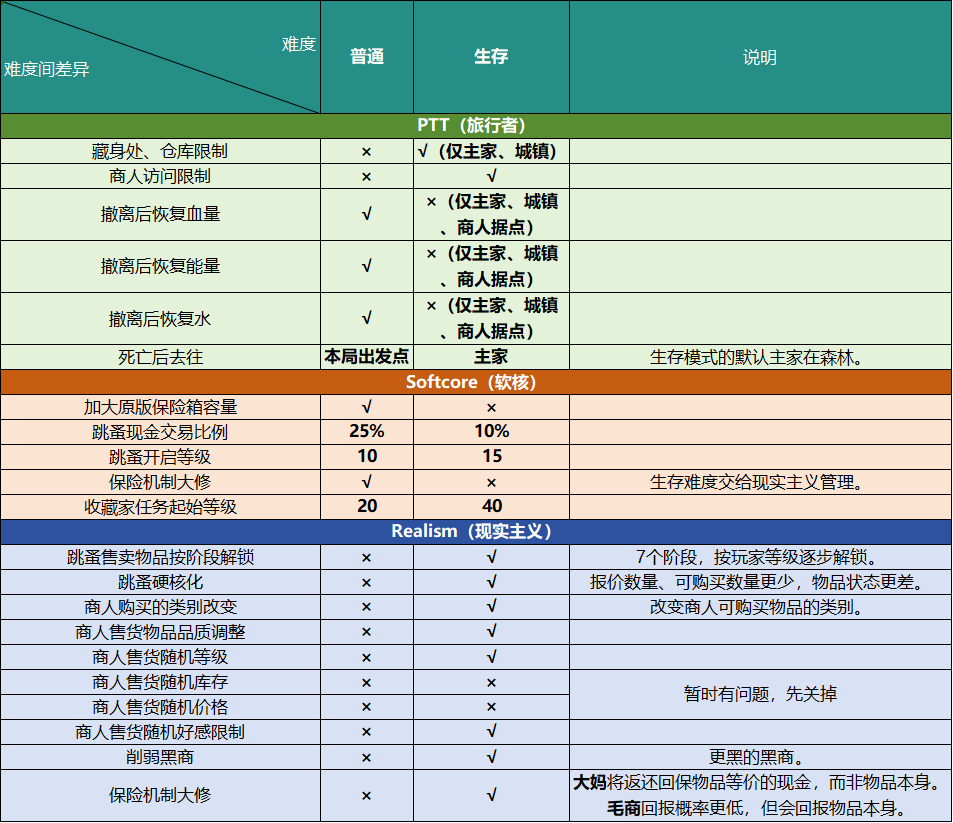

> [!NOTE]
> ##### 注：
>《现实化诺文斯克》Realized Norvinsk v0.9.x基于SPT3.9制作，开发阶段仅作为Q群内群友福利。正式版为v1.0.0，届时会正式对外发布，作为《诺文斯克潜行者》整合包搁浅阶段的替代。
>这里记录的是v0.9.0及之后的更新日志

# 24-8-9

《现实化诺文斯克》v0.9.0测试版发布，仅提供MO2+MOD，基于SPT3.9.5，恕不提供SPT本体，请自行下载。
安装流程与以往流程相同，所以暂不提供安装教程，也不提供安装指导，对我的整合包安装过程不熟悉的请勿下载使用。
测试阶段因黑商需征收保护费，所以仅提供迅雷下载链接：
https://pan.xunlei.com/s/VO3mwz4BFzM69JXGDtNRX3brA1?pwd=vk2m#
#### 必备但因尚未适配3.9.5所以未安装的MOD：
[Expanded Door Interactions：门扩展动作](https://hub.sp-tarkov.com/files/file/1865-expanded-door-interactions/)
[Fontaine's Weapon Modding Quality Of Life：战局内改枪](https://hub.sp-tarkov.com/files/file/1188-fontaine-s-weapon-modding-quality-of-life/)

#### 游玩须知：
1. 测试版的专属商人及专属任务均未完成，且不是最终形态。请勿提过多要求。后续会继续更新。
2. **《现实化诺文斯克》没有《诺文斯克潜行者》的难度阶梯，没有类无缝地图。**
3. 现实主义的3.9.5版正式版尚未发布，所以**装备配件数值重构并未实装**。后续会更新。
4. **《现实化诺文斯克》v0.9.0版SAIN预设-NorvinskStalkerAIpreset**还在不断调整期，可以对战局内AI行为和难度提出建议。
5. **《现实化诺文斯克》v0.9.0版好奇猫自用游戏设置及按键**默认开启，如果你有自己的游玩设置，请关掉或自己修改。
6. 基于自定义档案-ShadowXtrex-CustomProfiles制作**的“角色”化开局档案尚未动工**，现在仅有CustomProfiles自带的几个开局档案可供选择。

# 24-8-18

#### 更新日志：

- 新增：
	- [3]新武器-Rexana's Golden Deagle
	- [8]容易的技能选项-EasySkillOptions
	- [9]战局内外游戏BGM自定义-BobbysMusicPlayer，改变增加战局内外的BGM，
	- [9]原版HUD开关-ConfigHUD，可以自定义、关闭游戏原有的HUD
	- [2]新装备-SerWolfik-Heavy-Troopers：更多的星战面罩
- 更新：
	- [2]新服饰-SamSWAT-CoDMW_CTSFO1
	- [2]新装备-外骨骼-SamSWAT-DolgExoS2
	- [2]新服饰-MoxoPixel-TacticalGearComponent
	- [4]新商人-油漆匠-MoxoPixel-Painter
	- [5]现实主义大修-Fontaine-Realism-Mod
	- [10]UI大修-Tyfon-UIFixes
- 调整：
	- 调整Order.json，改进MOD间的兼容性。
	- 调整SAIN预设：《现实化诺文斯克》v0.9.0版SAIN预设-NorvinskStalkerAIpreset，让AI行为更拟人。
	- 调整《现实化诺文斯克》v0.9.0版SWAG-Donuts沉浸感增强设置，让战局内PMC的独狼和小队刷新更平衡。
	- 调整《现实化诺文斯克》v0.9.0版现实主义装备物品设置和预设，将《诺文斯克潜行者》118的大部分配件数值移植到《现实化诺文斯克》。
	- 《现实化诺文斯克》v0.9.0版Softcore沉浸感增强设置，减慢藏身处加工速度。

# 24-9-2更新日志：

- 新增：
	- [10]右键快速出售按钮-QuickSell
	- [3]新武器-WTT-Armory-Remington R5
	- [3]新武器-MC-M60
	- [8]可交互的撤离点及其API-Jehree-InteractableExfilsAPI
	- [3]新武器-MC-DEAGLE
	- [3]新武器-choccy-ksg12
	- [11]物品提取器-give-ui
	- [2]新容器-新的大子弹箱-RheddElBozo's Ammo Box
	- [3]新武器-WTT-Armory-M107
	- [8]可设置的脚步声音量-ConfigurableStepsVolume
	- [4]赏金任务-Trap-BabaYaga
	- [3]新配件包-AK系导轨-Ak Rail Extension
	- [4]Trap的自定义任务框架-CustomQuests
	- [1]前置框架-自定义交互-CustomInteractions
- 更新：
	- [10]UI大修-Tyfon-UIFixes
	- [9]战局内外游戏BGM自定义-BobbysMusicPlayer
	- [7]平衡的夜视装备视效-BORKEL'S REALISTIC NIGHT VISION GOGGLES(BRNVG)
	- [6]可指挥的AI队友-friendlypmc
	- [2]新人物脸型-MoxoPixel-WarHeads
	- [8]人物技能扩展和撬锁-SkillsExtended
	- [8]真实的尸体伤口-BORKEL'S BLOODY BULLET WOUNDS(BBBWP)
- 调整：
	- 调整Order.json，改进MOD间的兼容性。
	- 调整《现实化诺文斯克》v0.9.0版SkillsExtended沉浸感增强设置，适应新版本。
	- 优化MOD分类。
	- 调整《现实化诺文斯克》v0.9.0版Softcore沉浸感增强设置：保险重新设置，俄商1小时内回保，价格偏低，但回保率50%。医生2-3小时回保，价格贵，但回保率85%。
	- 调整：优化《现实化诺文斯克》专属商人-AliceIllusion.v.0.1.0的售卖列表。

# 24-9-11更新日志：

- 新增：
	- [3]新武器-WTT-M700LA
	- [3]新武器和新装备-ATLAS-GEAR
	- [2]新酒水-WTT - CornerStore
	- [7]可获取所有服装-RaiRaiTheRaichu-AllTheClothes
	- [12]机器人渲染控制-AdvancedBotCulling
	- [4]新任务线-圣殿陷落-operation-sanctumfall
	- [3]新配件-LLMVarioRay
	- [3]015新内容-RaiRaiTheRaichu-Update15Backport
	- 《现实化诺文斯克》v0.9.0版药品酒水沉浸感增强设置：调整MOD吃喝药品的部分功效。
- 更新：
	- [2]新装备-SerWolfik-Heavy-Troopers
	- [9]自定义游戏BGM-BobbysMusicPlayer
	- [5]自定义档案-ShadowXtrex-CustomProfiles
	- [10]UI大修-Tyfon-UIFixes
	- [10]仓库搜索框-StashSearch
	- [4]新商人-ArtemTrader
	- [8]开放所有撤离点-refringe-openextracts
	- [5]自定义战局时间-refringe-customraidtimes
	- [4]新商人-赌鬼-TheGambler
	- [4]新商人-acidphantasm-scorpion
	- [3]新武器-WTT-Armory-SVD
	- [9]同步线上跳蚤价格-DrakiaXYZ-LiveFleaPrices
- 调整：
	- 调整[5]自定义档案-ShadowXtrex-CustomProfiles：新增[现实化诺文斯克初始角色]：土生土长本地人角色、PMC老兵、PMC新兵、泰拉实验幸存者。每个角色在于开局条件不同。
		- PMC老兵：开局最容易。
		- PMC新兵：类似普通开局难度。
		- 土生土长本地人：较难开局。
		- 泰拉实验幸存者：无保险箱，最难开局。
	- 调整《现实化诺文斯克》v0.9.0版SWAG-Donuts沉浸感增强设置：调整了Donuts的AI刷新规则，让PMC和scav的刷新比率更平衡。
	- 调整《现实化诺文斯克》v0.9.0版SAIN预设-NorvinskStalkerAIpreset：继续减少AI听力，减少AI提前锁敌的可能性。
	- 调整《现实化诺文斯克》v0.9.0版True Items沉浸感增强设置：增加可堆叠的物品数量。
	- 调整Order.json，改进MOD间的兼容性。

# 中秋更新日志：

- 新增：
	- [3]新武器-97式步枪现代化-Mass_DG56
	- [3]新武器-97式步枪-Mass_QBZ97
	- [5]战局大修-Raid Overhaul
	- 《现实化诺文斯克》v0.9.0版Raid Overhaul沉浸感增强设置
	- [2]可弹奏的吉他-PlayableGuitar
	- [9]动态天气与季节-PreyToLive-DynamicWeatherAndSeasons
	- 
- 更新：
	- 大部分MOD武器、装备、物品。注意打开MO2的mod备注查阅
	- [2]新物品-镀金钥匙链（更好的钥匙容器）-Jehree-GildedKeyStorage
	- [6]可指挥的AI队友-friendlypmc（吃帧数）
- 调整：
	- 增加大部分MOD武器、配件的现实主义兼容补丁。
	- 测试性添加[5]战局大修-Raid Overhaul来进一步增强战局内的沉浸感。
		- 现在每局战局时长可长达16小时（999分钟），且按O显示时间是现实时间。
		- 可通过发射白色信号棒（注意：不是信号枪打的白色信号弹！）召唤物品回收箱（不能回收打包武器箱，会导致武器箱失效），及时回收你战局内收获的物品，提高续航。
		- 战局内会出现多种事件，事件概率已经过设置，仅有“断电”、“定时空投”、“技能升降”、“商人好感升降”、“撤离点暂时失效”会有不同概率触发。
	- 减慢月光、纯净水和Scav宝箱的制作速度。
	- 《现实化诺文斯克》v0.9.0版SWAG-Donuts沉浸感增强设置：减少所有战局的AI同时存在上限，并增加补位速度。
	- 暂时关掉[5]沉浸式日夜循环-ImmersiveDaylightCycle。
- 淘汰：
	- [5]自定义战局时间-refringe-customraidtimes，由[5]战局大修-Raid Overhaul取代
	- [12]战场清理-BDSM，由[5]战局大修-Raid Overhaul取代
	- [9]所有季节随机开启-AllTheSeasons，由[9]动态天气与季节-PreyToLive-DynamicWeatherAndSeasons取代
	- [2]新物品-krackasourus的可集换卡和物品-ALL IN ONE，物品太多，顶掉了太多其他类型的垃圾。
	- 一堆懒得做现实主义兼容，使用频率又少的MOD武器。

# 24-9-30更新日志：

- 新增：
	- [1]前置框架-商人可售卖装有东西的容器-TradersSellBundles
	- [5]伪无缝地图-通往塔科夫之路-Trap-PathToTarkov
	- 《现实化诺文斯克》PathToTarkov沉浸感路径
	- [4]新商人-Viper
	- [3]新武器-机枪-WTT-Armory-M249，并增加现实主义补丁
- 更新：
	- [10]右键快速出售按钮-QuickSell
	- [10]UI大修-Tyfon-UIFixes
	- [3]新武器-狙击步枪-WTT-M700LA，加入第三方现实主义兼容补丁
	- [3]新武器-狙击步枪-WTT-Armory-M107已制作所有配件的兼容补丁
	- [2]新装备、衣服-MoxoPixel-TacticalGearComponent
	- [3]新武器-狙击步枪-WTT-Armory-Remington MSR
	- [5]现实主义大修-Fontaine-Realism-Mod，现版本主要重做了整个污染区系统。
	- [7]瞄准视野大修-Fontaine-FOV-Fix
	- [6]AI视野真实化-That's Lit（吃帧数）
- 调整：
	- 调整《现实化诺文斯克》v0.9.0版SAIN预设-NorvinskStalkerAIpreset：现在AI没有那么容易发现你了，但你不会希望他们打先手的。
	- 调高跳蚤出售成功概率。
	- 调整《现实化诺文斯克》现实主义装备物品设置和预设，更新配件参数：前握把属性、枪托属性、消声器属性等。
	- 调整《现实化诺文斯克》现实主义装备物品设置和《现实化诺文斯克》药品酒水沉浸感增强设置：现在部分水和饮料，以及糖不用再一口气喝完吃完了。
	- 调整《现实化诺文斯克》专属商人及任务线-AliceIllusion：售卖列表添加多两把武器。
	- 调整[5]自定义档案-ShadowXtrex-CustomProfiles
	- 重新增加了PTT和原本弃置的PTT路径。
	- 调整Order.json，改进MOD间的兼容性。
	- 新增加的任务线文本翻译。
- 淘汰：
	- 

# 24-10-11更新日志：

- 新增：
	- [4]新商人-藏身处物资商人-acidphantasm-harryhideout
	- [8]可拾取穿墙物品-ReachExtender
	- [8]声音可视化-acidphantasm-accessibilityindicators
	- [9]简单的锻炼QTE-acidphantasm-simpleworkoutqte
- 更新：
	- [6]AI拟人MOD的前置框架-DrakiaXYZ-BigBrain（吃帧数）
	- [6]AI路径扩展-DrakiaXYZ-Waypoints
	- [4]新商人-毒蛇-Viper
	- [9]同步线上跳蚤价格-DrakiaXYZ-LiveFleaPrices
	- [2]新物品-镀金钥匙链（更好的钥匙容器）-Jehree-GildedKeyStorage
	- [8]人物技能扩展和撬锁-SkillsExtended
- 调整：
	- 关闭部分物品MOD，减轻服务器负担（大概吧）
	- 稍微调降了所有地图的物资刷新率
	- 将角色和难度分离，现在难度主要靠4个不同的主家：森林、海关、中心区、实验室。
	- 对泰拉实验幸存者角色进行了优化和调整，现在更像试验品了。
	- 各主家不再能访问到除了黑商、藏身处物资商人以外的其他商人
	- 改进部分点位的仓库大小
	- 调低所有AI（非PMC、Scav的其他AI）的刷新率和刷新频率
	- 减少武器故障率
	- 新增了一些任务汉化
	- 尝试让[9]同步线上跳蚤价格-DrakiaXYZ-LiveFleaPrices不再爆红，跳蚤价格能同步
	- 再次调整Order.json，改进MOD间的兼容性。
- 淘汰
	- 无
- 与正式版的距离
	- [《现实化诺文斯克》v0.9——1.0进度看板](《现实化诺文斯克》v0.9——1.0进度看板.md)

# 24-10-27-v0.9.7更新日志：

### ⚠️警告：更新此版本需要重开新档！！
- 新增：
	- [12]修复小白格bug-MarsyApp-WhiteBoxFix，可以修复屏幕中央白色方块bug
	- [2]新服饰-RCTA.-.Synaptic.T1.1.4，几套可以让任务变成机器人的衣服
	- [8]怜悯的战利品-bakahashi-pityloot，让物资的生成紧贴人物的各项需要，可以控制物资刷新
	- [2]可以玩的GameBoy-WTT-KomradeKid，可以让你在塔科夫里玩Gameboy
	- [8]武器操控大修-TarkovIRL_WeaponsHandlingMod，测试，将改变人物角色持握武器的动作动画，变得更真实。
	- [6]超精简AI生成-DewardianDev-MOAR，准备取代SWAG管理AI生成，已测试，不好用。
	- [6]更好的生成-PreyToLive-BetterSpawnsPlus，测试中，用于取代SWAG管理AI生成。
	- [4]任务条件随机化-leaves-questrandomizer，默认关闭，打开他的话需要重开新档，会讲大部分任务的完成条件改掉。
	- [2]新服饰-Skeleton
- 更新：
	- [9]内置动态地图-DynamicMaps
	- [11]我就是爹游戏模式-dvize.DadGamerMode
	- [11]物品感应-AmandsSense
	- [10]便捷出售-IhanaMies-LootValue
	- [10]仓库搜索框-StashSearch
	- [10]UI大修-Tyfon-UIFixes
	- [9]物品打勾标记提供更多信息-MoreCheckmarks
	- [9]游戏画质改善-阿曼达的图形-Amanda's Graphics
	- [8]多种可选准心-SimpleCrosshair
	- [8]boss提醒器-BossNotifier
	- [8]任务跟踪显示-DrakiaXYZ-QuestTracker
	- [8]声音可视化-acidphantasm-accessibilityindicators
	- [7]瞄准视野大修-Fontaine-FOV-Fix
	- [6]AI动态生成点-SWAG-Donuts（吃帧数）
	- [6]AI自动搜索物品-Skwizzy-LootingBots（吃帧数）
	- [6]AI增强-SAIN（吃帧数）
	- [4]新商人-赌鬼-TheGambler
	- [2]新物品-镀金钥匙链（更好的钥匙容器）-Jehree-GildedKeyStorage
	- [6]可指挥的AI队友-friendlypmc（吃帧数）
	- [3]015新内容-RaiRaiTheRaichu-Update15Backport
	- [9]物品信息显示优化-子弹专家-MunitionsExpert
	- [5]现实主义大修-Fontaine-Realism-Mod
- 调整：
	- **特别鸣谢：Volcano进行了部分MOD的汉化并授权本整合包使用。**
	- 外骨骼头盔现在可以放到面具槽位，来让他的防毒面具功能生效
	- 优化了所有角色的初始装备
	- PTT终究不是traveler，限制商人和仓库并不会给游戏体验带来更多沉浸感，反而是负担，所以关闭了。现在PTT提供的仅仅只是地图间移动功能和不同出生点的选择。
	- 现在实验室的电梯可以正常使用了
	- 现在撬锁工具重新有次数限制了
	- 因为SWAG停更，所以开始尝试用[6]更好的生成-PreyToLive-BetterSpawnsPlus取代SWAG来管理AI生成。
	- 调整子弹的堆叠数量。
	- 调整可交易物品的堆叠数量。
	- 更新了大地图。
	- 削弱AI的听力范围。
	- 再次调整Order.json，改进MOD间的兼容性。
- 淘汰
	- 无
- 与正式版的距离
	- [《现实化诺文斯克》v0.9——1.0进度看板](《现实化诺文斯克》v0.9——1.0进度看板.md)

# 24-11-08-v0.9.7.5更新日志：

### ⚠️警告：更新此版本需要重开新档！！
- 新增：
	- [2]头声选择器-WTT-HeadVoiceSelector，玩家可以像选择服装一样自由选择头部和声音。
	- [2]女性人物脸型身型和声音-WTT-W.A.A.C
	- [6]AI自动做任务-DanW-SPTQuestingBots，现在AI除了捡东西，也有自己想做的事情了，比如追杀玩家。
	- [2]更多的仓库容器-randomizzatore-morecases，贵的离谱但容量更大的仓库容器。
	- 《现实化诺文斯克》BetterBackpacks沉浸感增强设置，增加了对MOD背包的扩大支持。
- 更新：
	- [6]AI视野真实化-That's Lit（吃帧数）
	- [6]超精简AI生成-DewardianDev-MOAR
	- [9]主菜单大修-MoxoPixel-MenuOverhaul
	- [2]可以插卡玩的GameBoy-WTT-KomradeKid
	- [2]新BOSS-惩罚者-WTT-RogueJustice
	- [6]AI自动搜索物品-Skwizzy-LootingBots
	- [4]任务条件随机化-leaves-questrandomizer
	- [9]内置动态地图-DynamicMaps
	- [8]武器操控大修-TarkovIRL_WeaponsHandlingMod
- 调整：
	- **特别鸣谢：Volcano进行了部分MOD的汉化并授权本整合包使用。**
	- 优化了阿曼达图形的环境光和DOF设置。
	- 现在所有AI都减少了使用垃圾子弹。
	- 进一步优化MOAR的AI刷新规则。
	- 调整战局的总时长为205分钟。
	- 调低绝大部分弹匣、弹鼓的故障率。
	- 修复所有实验室电梯门撤离点。
	- 尝试让黑车恢复付款撤离。
	- 让部分MOD药品可以在战局内使用了。
	- 扩大了部分MOD背包的容量。
	- 再次尝试修复[9]同步线上跳蚤价格-DrakiaXYZ-LiveFleaPrices的爆红。
	- 调整了AI的强度，让Boss和PMC的强度更平衡。
	- 正式确定用MOAR来取代SWAG管理AI的生成，并对生成规则进行进一步细化调整。
	- 清理了一些不再使用的旧MOD。
	- 再次调整Order.json，改进MOD间的兼容性。
- 淘汰
	- [3]全地图随机阔剑地雷-DrakiaXYZ-Hazardifier
	- [6]更好的生成-PreyToLive-BetterSpawnsPlus
- 与正式版的距离
	- [《现实化诺文斯克》v0.9——1.0进度看板](《现实化诺文斯克》v0.9——1.0进度看板.md)

# 24-11-09-v0.9.7.5.热修日志：

- 新增：
	- 无
- 更新：
	- [8]武器操控大修-TarkovIRL_WeaponsHandlingMod
- 调整：
	- 《现实化诺文斯克》主家位置：中心区和《现实化诺文斯克》主家位置：海关在0975发布前为了测试改了设置，需要改回。
	- 调减一点点PMC数量

# 24-11-17-v0.9.7.8更新日志：

### ⚠️警告：
1. **更新此版本需要完全删除旧MO2文件夹（即Realized_Norvinsk_v0.9_Test）并重开新档！！**
2. **本次更新加入的联机模块仅为方便多机玩家主客分离和技术探索、测试使用。暂不提供教程。自行搭建服务器和自行联机游玩出现的任何技术问题、法律后果请自己承担！我也不提供搭建联机服务器的技术支持！**
- 新增：
	- [3]新配件-EpicRangeTime-Weapons和现实主义兼容
	- [4]新商人-安德鲁迪斯任务狂人-Andrudis Questmaniac，这个mod新增了6个商人和4553个任务
	- 联机模块，实现服务端、客户端分离，可为多电脑玩家在局域网内提供联机PVE体验。并为SPT3100时的联机服务器做准备。
		- [0]客机（游戏机）使用的配置文件
		- [0]主机（服务器）使用的配置文件
		- [0]离线联机模块-服务器端用-fika-server
		- [0]离线联机模块-客户端用-Fika.Release
		- [0]kmyuhkyuk-EFTApi+Fika兼容版本
		- [0]That's Lit+Sync AI视觉优化+Fika联机兼容（已汉化）
- 更新：
	- [6]超精简AI生成-DewardianDev-MOAR，并更新最新汉化补丁。
	- [8]武器操控大修-TarkovIRL_WeaponsHandlingMod，并更新最新汉化补丁。
	- [8]随机坠机点-SamSWAT.HeliCrash.ArysReloaded
	- [12]停止不应有的子弹碎片声-Solarint-BulletCrackFix
	- [9]内置动态地图-DynamicMaps，并更新最新汉化补丁。
	- [5]战局大修-Raid Overhaul的汉化补丁
- 调整：
	- **特别鸣谢：
	- 极大增加战局大修附属Boss——Legion的刷新几率。因为他的武器是本包中唯一能击穿动力甲的武器。
	- 将[4]新BOSS-惩罚者-WTT-RogueJustice的生成率固定为25%。
	- 继续调整MOAR的AI生成数量。
	- 增补两个MOD背包的扩容。
	- 现在MOD针剂也可以堆叠了。
	- 动态天气：四季回归，现在天气会按一小时一个月，3个小时一个季节，12小时按序四季循环。
	- 调整《现实化诺文斯克》SAIN预设-NorvinskStalkerAIpreset，减少AI总体进攻性。
	- 更新角色："[现实化诺文斯克初始角色]Samuel是不是好奇猫"的出生装备和仓库内容。
	- 再次调整Order.json，改进MOD间的兼容性。
- 淘汰/关掉
	- 一些物品mod和商人mod以减少需要加载的bundle
- 与正式版的距离
	- [《现实化诺文斯克》v0.9——1.0进度看板](《现实化诺文斯克》v0.9——1.0进度看板.md)

# 24-11-18-v0.9.7.8热修日志：

### ⚠️提醒：本热修不用重开档。
### 鸣谢：本包陆续更新的汉化均由Volcano制作并授权本包使用。
- 新增：
	- 无
- 更新：
	- [11]空中支援-SamSWAT-FireSupport的汉化
	- [10]UI大修-Tyfon-UIFixes
	- [9]内置动态地图-DynamicMaps（已汉化）
	- [8]真实的尸体伤口-BORKEL'S BLOODY BULLET WOUNDS(BBBWP)的汉化
	- [8]武器破门-dvize.BackdoorBandit的汉化
	- [6]AI自动做任务-DanW-SPTQuestingBots（汉化）
	- [4]新商人-赌鬼-TheGambler的汉化
	- [4]新商人-油漆匠-MoxoPixel-Painter的汉化
	- [3]新配件-MoxoPixel-MagTape的汉化
	- [3]新配件-MoxoPixel-SandCore的汉化
	- [2]新装备、衣服-MoxoPixel-TacticalGearComponent的汉化
- 调整：
	- 修正了战局大修导致的进实验室需要记号卡的问题。
	- 修正MOAR的AI数量生成。
	- 再次调整Order.json，改进MOD间的兼容性。
	- Boss通知插件的提示能力，现在会根据情报中心等级解锁。F12可调。
	- 动态地图上显示信息的多寡，现在会根据情报中心等级解锁。F12可调。
	- MOAR（摩尔生成）的F12编辑预设功能有问题，修改参数请到它本体的config里修改。
- 淘汰/关掉
	- 
- 与正式版的距离
	- [《现实化诺文斯克》v0.9——1.0进度看板](《现实化诺文斯克》v0.9——1.0进度看板.md)

# 24-11-21-v0.9.7.8热修2-4日志：

### ⚠️提醒：本热修不用重开档。
### 鸣谢：本包陆续更新的汉化均由Volcano制作并授权本包使用。
- 新增：
	- [0]双端自动文件同步-Corter-ModSync
- 更新：
	- [3]新配件-MoxoPixel-GreenCore的汉化
	- [3]新配件-MoxoPixel-SandCore的汉化
	- [3]新配件-MoxoPixel-WhiteCore的汉化
	- [4]新商人-毒蛇-Viper的1.0.4和汉化
	- [6]超精简AI生成-DewardianDev-MOAR，退版本到未增加F12功能的版本。
	- 《现实化诺文斯克》主家位置：海关去除地图间移动模式
	- 《现实化诺文斯克》主家位置：森林去除地图间移动模式
	- 《现实化诺文斯克》主家位置：实验室去除地图间移动模式
	- 《现实化诺文斯克》主家位置：中心区去除地图间移动模式
- 调整：
	- 因为PTT有Bug，所以去除地图间移动模式。
	- [0]双端自动文件同步-Corter-ModSync是一个可以在联机时，客机可以自动匹配服务端文件，并更新服务端最新文件到客机的MOD。这样可以确保联机时，双端文件的同步。
- 淘汰/关掉
	- 
- 与正式版的距离
	- [《现实化诺文斯克》v0.9——1.0进度看板](《现实化诺文斯克》v0.9——1.0进度看板.md)

# 24-12-06-v0.9.7.9更新日志：

### ⚠️提醒：==需要删除v0.9.7.8及之前版本的MO2==，建议重开档。
### 鸣谢：本包陆续更新的汉化均由Volcano制作并授权本包使用。
- 新增：
	- 《现实化诺文斯克》生存模式测试版
	- [9]自定义游戏BGM《2077专题》-BobbysMusicPlayer-比特币小姐编排
	- [9]自定义游戏BGM《潜行者2专题》-BobbysMusicPlayer
	- [13]简单翻译器-Simple Translator 文本汉化
	- [10]物品自动归类按钮-Tyfon-AutoDeposit
- 更新：
	- 《现实化诺文斯克》Raid Overhaul沉浸感增强设置和汉化
	- 《现实化诺文斯克》主家位置：XX 更名为：《现实化诺文斯克》普通模式-主家位置：XX，以区分新增加的生存模式
	- 重做《现实化诺文斯克》专属商人及任务线-AliceIllusion
	- [8]武器操控大修-TarkovIRL_WeaponsHandlingMod（已汉化）
- 调整：
	- 增加生存模式的测试版本，为基于3.10.x的现诺1.0做准备
		- 
	- 对《现实化诺文斯克》Raid Overhaul沉浸感增强设置和它的汉化重新做了整合，尝试消除PTT的无法离开主家的BUG。==这个模式必须放在MO2列表的最后，==开启生存模式后，它将覆盖《现实化诺文斯克》Softcore沉浸感增强设置、《现实化诺文斯克》现实主义装备物品设置和预设、《现实化诺文斯克》普通模式-主家位置：XX的部分或全部文件。
	- 《现实化诺文斯克》专属商人及任务线-AliceIllusion重新制作了售卖列表，并重做了主线的序章任务
	- 使用[13]简单翻译器-Simple Translator 文本汉化增加更多服务器端MOD的汉化补丁，未来310x都会用它来保存服务器端MOD的汉化。
	- 增加黑车和合作撤离点所需要的费用。
	- 稍微降低物品生成量。
	- 再次调整Order.json，改进MOD间的兼容性。
- 淘汰/关掉
	- [4]新商人-安德鲁迪斯任务狂人-Andrudis Questmaniac，因为跟QB一起用确实会导致掉帧。
	- [9]同步线上跳蚤价格-DrakiaXYZ-LiveFleaPrices，因为3100更新后这个mod似乎失效了。
- 与正式版的距离
	- [《现实化诺文斯克》v0.9——1.0进度看板](《现实化诺文斯克》v0.9——1.0进度看板.md)

# 24-12-06-v0.9.7.9热修更新日志：

### ⚠️提醒：0979更新热修只需要解压后覆盖MO2文件夹即可，但建议重开档。
### 鸣谢：本包陆续更新的汉化均由Volcano制作并授权本包使用。
- 新增：
	- 1
- 更新：
	- 2222
- 调整：
	- [5]现实主义大修-Fontaine-Realism-Mod
	- [6]超精简AI生成-DewardianDev-MOAR
	- 《现实化诺文斯克》普通模式-主家位置：海关
	- 《现实化诺文斯克》普通模式-主家位置：森林
	- 《现实化诺文斯克》普通模式-主家位置：实验室
	- 《现实化诺文斯克》普通模式-主家位置：中心区
	- 《现实化诺文斯克》生存模式测试版
	- 《现实化诺文斯克》现实主义装备物品设置和预设
	- 再次调整Order.json，改进MOD间的兼容性。
- 淘汰/关掉
	- 
- 与正式版的距离
	- [《现实化诺文斯克》v0.9——1.0进度看板](《现实化诺文斯克》v0.9——1.0进度看板.md)
