# 「Norvinsk Stalker」

## 【诺文斯克潜行者】1.1.8 版安装/技术手册

### 手册说明

本手册主要内容整合包的安装教程和技术说明，以及游玩过程中可能遇到的部分 BUG、程序问题的解决方案。

游玩过程中遇到的游玩方式的疑问请查阅另一个《游戏手册》。

本整合包正式版为免费整合包，仅测试版需要发电领取。

整合包作者：Samuel是不是好奇猫

B站ID：Samuel是不是好奇猫

B站主页：[https://space.bilibili.com/9883076](https://space.bilibili.com/9883076)

爱发电ID：Samuel是不是好奇猫

爱发电主页：[https://afdian.net/a/samuel_szeto](https://afdian.net/a/samuel_szeto)

### 特别鸣谢页

Q群群友:

1.0.0版教程的修正：随风而去

1.0.0版整合问题反馈：珠泪哀歌族·？

1.0.0版大地图汉化：出走在远方

"点击开始游戏却没有反应"的解决方案：夜熙、夢遊于華胥之國、旗不礼、BadForNight

Traveler 商人位置修改补丁的制作和测试：KHORNE 制作，树上骑柒只猴

制作对应的实时地图修改：树上骑柒只猴

1.0.5版新 Traveler 大地图指引制作：风吟随行

1.0.5版测试人员：珠泪哀歌族·？、那我就特别凶、恰啡就是咖啡、憨伍蒂

1.1.0版测试人员：TianMeng、Nigri、Rivaille、E_lizard、加把劲骑士、Kang、Weeping Dawn

1.0.0热修鸣谢：Kang、E_lizard、B站UP：Oo大H豆oO、刀刀

1.1.8版测试人员：一只梅狸猫、公用带星怒、随风而去、童某、悲剧龙

整合包所用 MOD 作者及下载链接：

塔科夫MOD社区网站：[https://hub.sp-tarkov.com/files/](https://hub.sp-tarkov.com/files/)

国内塔科夫MOD社区 ODDBA：[https://sns.oddba.cn/](https://sns.oddba.cn/)

【AT&萱苏 联合制作】QBU201狙击步枪&QBZ191自动步枪：
[https://sns.oddba.cn/113180.html](https://sns.oddba.cn/113180.html)

[AKI 3.5.8~3.7.6]少女前线—诺文斯克行动MOD V4.1：
[https://sns.oddba.cn/99015.html](https://sns.oddba.cn/99015.html)

TRAVELER 1.1.1：
[https://hub.sp-tarkov.com/files/file/1212-traveler/](https://hub.sp-tarkov.com/files/file/1212-traveler/)

SPT REALISM MOD 0.14.12：
[https://hub.sp-tarkov.com/files/file/606-spt-realism-mod/](https://hub.sp-tarkov.com/files/file/606-spt-realism-mod/)

SOFTCORE (PROPER SINGLEPLAYER EXPERIENCE FOR SPT) 1.7.0：
[https://hub.sp-tarkov.com/files/file/998-softcore-proper-singleplayer-experience-for-spt/](https://hub.sp-tarkov.com/files/file/998-softcore-proper-singleplayer-experience-for-spt/)

RAID OVERHAUL 1.5.0：
[https://hub.sp-tarkov.com/files/file/1673-raid-overhaul/](https://hub.sp-tarkov.com/files/file/1673-raid-overhaul/)

说明手册借鉴自：
BB84的辐射4整合包《废土蓝调2.0》：
[https://www.bilibili.com/video/BV1z54y1Z7hv/](https://www.bilibili.com/video/BV1z54y1Z7hv/)

谨以此版本纪念我的两只爱猫

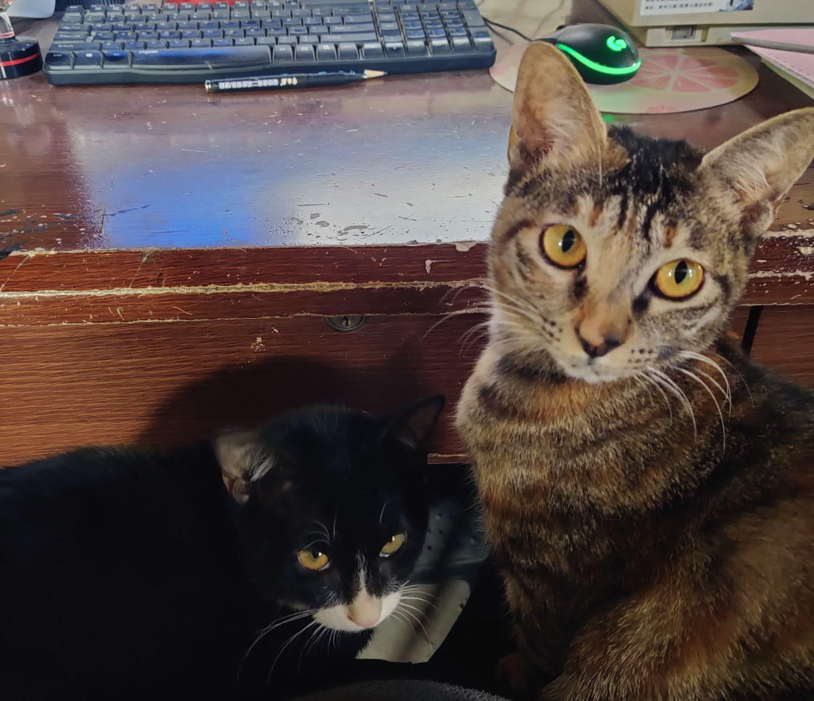

大头：3月11日

灵灵：3月13日

## 安装教程

### 安装前必读事项

0. **整合包玩家必做内存管理步骤**：离线版本身要电脑同时运行服务器端，所以实际上比在线版更吃系统资源。同时我的整合包有大量 MOD，内存占用则更多，如果不做以下步骤，必定出现爆内存闪退情况：

   （1）必须将虚拟内存大小设置为你物理内存的 1 到 1.5 倍，即使你电脑有 128G 物理内存也要！问就 NJT 的傻逼内存优化不行！设置方法 B 站自寻。

   （2）必须安装内存管理软件：ProcessLasso 或 MemReduct 均可，第一个没效果则用第二个。我个人使用前者，内存清理推荐设置如下：

   设置步骤——

   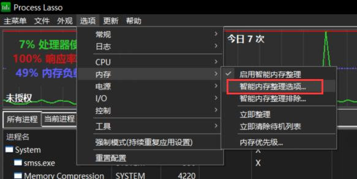

   设置如下即可：

   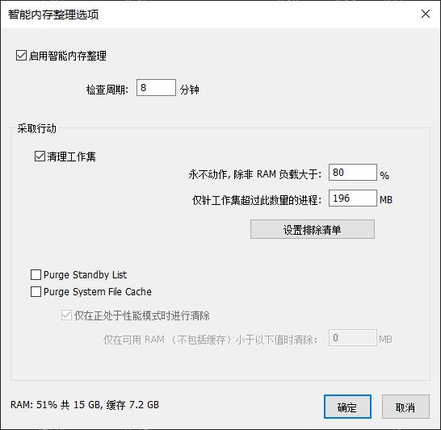

   MemReduct 也推荐到每 8 分钟如果 80% 内存占用以上清理一次的设置。

1. **整合包存档备份指南**，共要备份三个文件夹：

   (1) 存档文件本身：`Norvinsk_Stalker_118\overwrite\user\profiles` 整个文件夹。

   (2) 游戏设置：`Norvinsk_Stalker_118\overwrite\user\sptsettings` 整个文件夹。

   (3) Traveler 数据：`Norvinsk_Stalker_118\overwrite\user\mods\Traveler\profiles` 整个文件夹。

2. 本整合包 1.1.8 版支持 1.0.0 到 1.1.0 的存档，但请开新档游玩。1.1.5 版生存、浪人模式玩家请回到森林主家再更新新版，普通难度（容易——困难）玩家请前往海岸线或灯塔隧道再更新，否则由于地图变化，可能导致存档无法进入。

3. 测试版目前发现 MO2 备注可能有乱码，可能涉及压缩编码问题，因本整合包使用 Bandizip 压缩，最好使用同款软件解压，本软件安装包已放在网盘的"0、【非正版玩家才用】前置系统环境软件"文件夹中。

4. 本整合包 1.1.8 版以离线版 3.7.6 本体为基础，有 `Norvinsk_Stalker_118` 和 `Norvinsk_Stalker_376`（分卷包）两个压缩包，"118"MOD 管理器和 MOD，"376"游戏本体，请两个都下载。注：分卷包指 zip、z01-z05 共 6 个文件都要下载，解压仅需解压 zip 即可。解压软件推荐 Bandizip，因为我用它压缩的。

5. 如果你懂安装，请遵循本技术手册中的安装教程安装整合包，不要跳过任何一步。本教程部分配图使用旧版本的截图，但道理相通，就改了。

6. 本整合包多个核心 MOD 与超级模块大量功能存在冲突，非常不建议与超级模块一起食用。

7. 由于离线版的 MOD 原本的安裝方式与 MO2 安装/管理 MOD 的方式不同，且我提供的本体中带有存档编辑器，强烈建议您使用我提供的游戏本体。

8. 核心 MOD：Traveler 有独有的卸载程序，建议不要随意关闭，如想关闭，请在关闭后直接新开档游玩。

9. 整合包游戏本体和 MO2 路径均不可以有中文，且文件夹堆叠不宜过深，路径不宜过长。

10. 请不要擅自修改本体文件夹里的 `Aki.Launcher.exe` 和 `Aki.Server.exe` 的文件名，这样会导致 MO2 无法识别游戏。

11. 如果你懂得使用 MO2 并有一个已经在使用的 MO2，请使用该链接中：[https://hub.sp-tarkov.com/files/file/1314-spt-modorganizer-integration/](https://hub.sp-tarkov.com/files/file/1314-spt-modorganizer-integration/) 的 MO2 塔科夫兼容插件并按教程建立实例即可。

12. 对整合包进行任何自行改动之前，你都要知道自己在做什么。

### 具体安装步骤

#### 一、整合包老玩家请看这里

1. 离线版 3.7.5 开始的去正版验证增加了一个步骤，如果你非正版拥有者，或电脑中没有安装正版，请重新用网盘中的"1、【非正版玩家才用】3.7.6 新正版验证程序"重新做一次去正版验证。

2. 1.1.8 启用的 MO2 版本为最新版 2.5.1rc1，可能有少数电脑用这个版本会有问题。如果你在正确安装整合包后，用 2.5.1rc1 启动游戏出现加载 MOD 数量为 0 或其他的情况，请更换 MO2 版本为网盘中的"Mod.Organizer-2.4.4+SPTAki 兼容"，即，将这个 244 版本解压，然后将 `Norvinsk_Stalker_118` 中的"mods"、"profiles"、"overwrite"三个文件夹复制到 244 文件夹中，按下面安装教程重建实例即可。

#### 二、整合包新玩家从这里开始看

先为整合包创建一个简洁易懂的文件路径，以下将按我自己的实例路径为例讲解（这里推荐萌新玩家、懒人照抄。懂 MO2 的玩家也可以按自己喜好自定路径，我这里仅为方便教学。）：在 E 盘根目录下创建"EFT_Offline"文件夹。

#### 三、

#### 四、

将 `Norvinsk_Stalker_118` 和 `Norvinsk_Stalker_376` 两个压缩包解压后得到的以下文件剪切到"EFT_Offline"中。

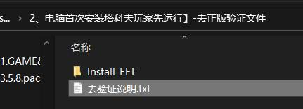

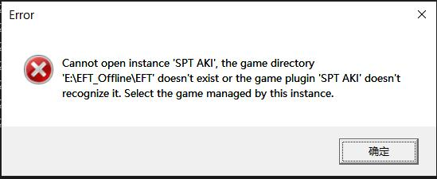

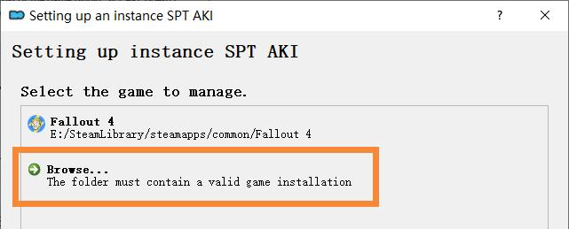

即此时游戏本体路径应为：`E:\EFT_Offline\Norvinsk_Stalker_376`。MO2 路径应为：`E:\EFT_Offline\Norvinsk_Stalker_118`

#### 五、

电脑首次安装塔科夫的玩家，请先按照"1、【非正版玩家才用】3.7.6 新正版验证程序"中的去验证说明.txt 使用塔科夫去验证补丁。

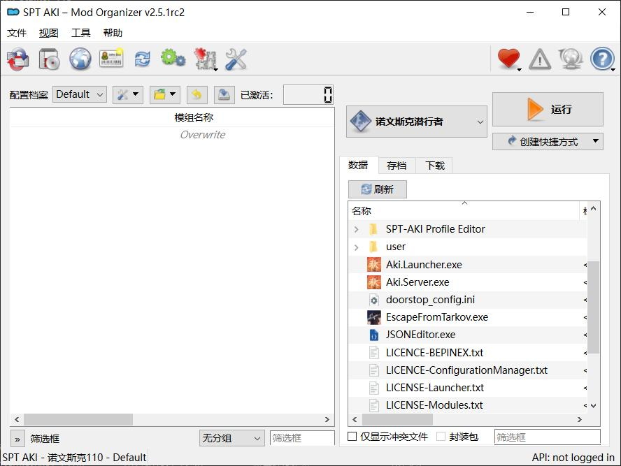

注意：电脑从来没装过任何版本的《逃离塔科夫》、或完整卸载过塔科夫的电脑的才需要使用这个"去正版验证文件"文件。电脑已有正版《逃离塔科夫》或其他离线版本的玩家请跳过这一步。

#### 六、创建实例

以上步骤——下载游戏本体和做正版验证确认完成后，打开 `E:\EFT_Offline\Norvinsk_Stalker_118`，运行里面的 `ModOrganizer.exe`，便打开 MO2。

如果直接照抄我上面的实例路径（即盘符、文件夹、路径全部一致），打开 MO2 后看到的界面应该如下图所示，等于 MO2 直接读取了我包中已有的实例。可跳到第五步之后，继续操作。

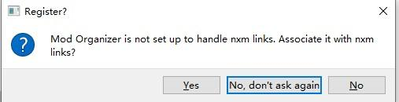

如果没有使用我上面的实例路径，MO2 应该会提示以下错误，这表示 MO2 没找到可识别的实例，这里只需要按"确定"即可跳到创建实例的步骤。

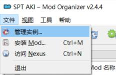

#### 七、实例配置

上部确定后弹出此窗，选择黄框 Browse，

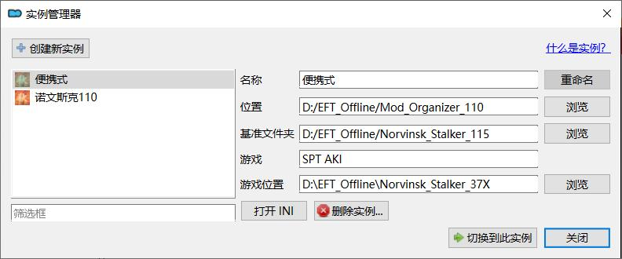

将路径选择到你自己的游戏本体目录——

会跳到一个空白的 MO2 界面如下：

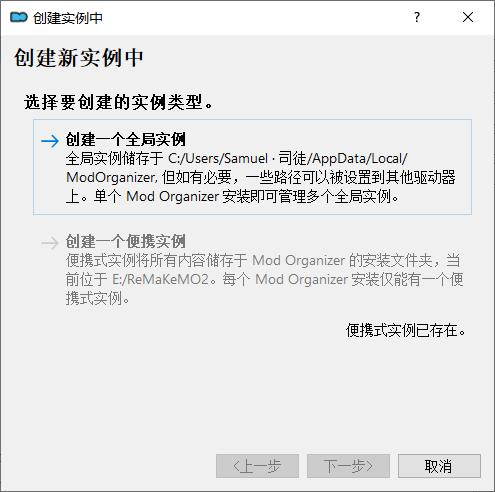

如果第一次打开 MO2 途中如果出现下图——

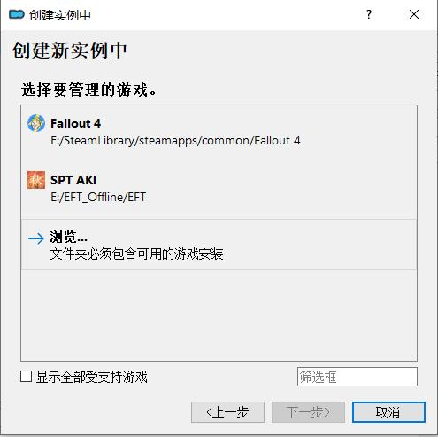

点中间"no, don't skip again"即可。

接下来我们点击左上角的"文件"——"管理实例"

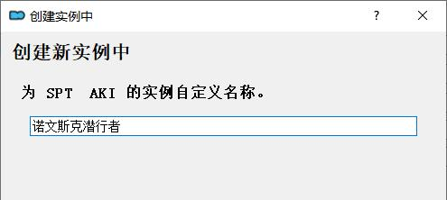

在弹出的窗口中选择"创建新实例"：

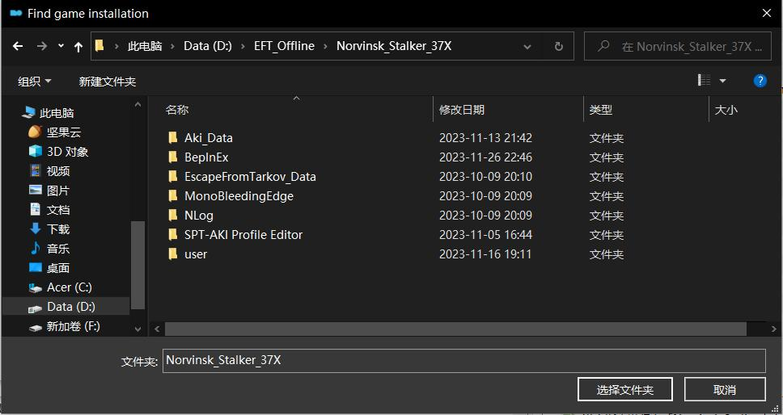

在弹出的窗口中任意选择一个皆可，选择"创建一个全局/便携实例"后，点下一步。

在之后弹出的这个窗口中选择"浏览..."

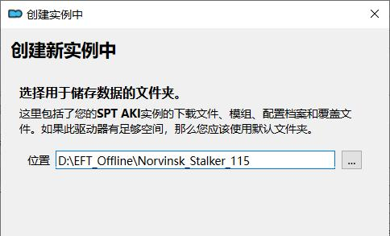

选中游戏本体目录。例如：`E:\EFT_Offline\Norvinsk_Stalker_376` 文件夹，并按"选择文件夹"。

并为实例设定名称，例如以下：

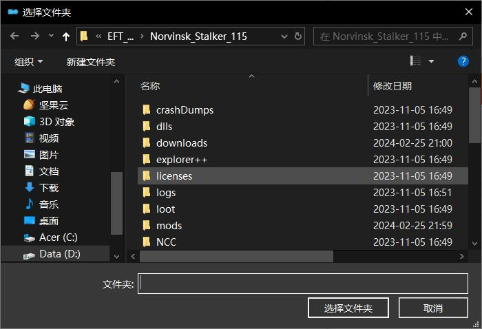

然后在下一步的窗口中——

将位置的路径选择为：`E:\EFT_Offline\Norvinsk_Stalker_118` 文件夹，并按"选择文件夹"

在随后的这个窗口中，确定实例的位置定位在你的：`E:\EFT_Offline\Norvinsk_Stalker_118`

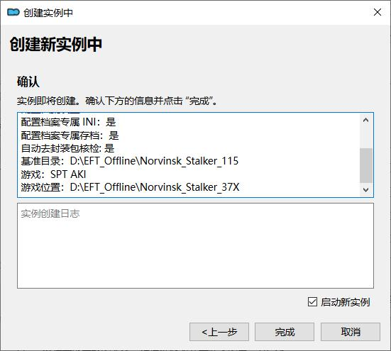

游戏的位置定位在你的：`E:\EFT_Offline\Norvinsk_Stalker_376`

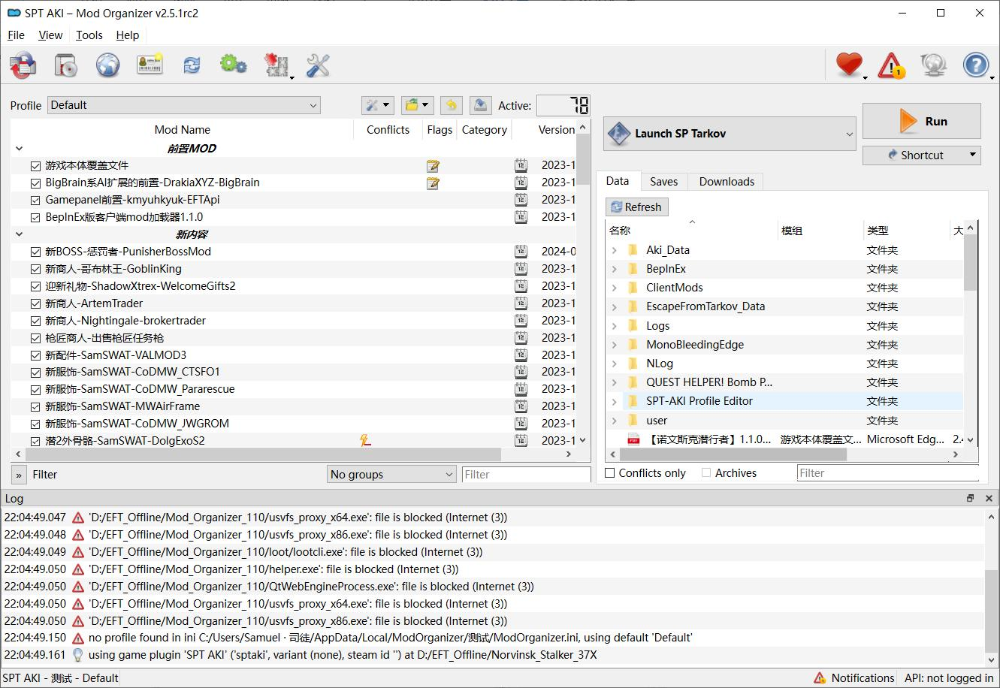

便可点击"完成"。

#### 八、实例创建完成

点击完成后，会自动打开 MO2 和该实例，显示如下界面，这证明实例已创建成功：

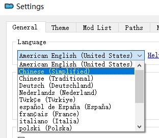

现在开始设置阶段。在进行下一步之前，先改设置换成中文界面 tools-settings-Chinese(simplified)

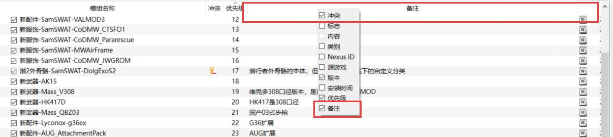

然后 OK 即可——

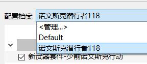

然后将 MOD 列表中的备注拉出来——

右键黄框一栏，按如图所示将"备注"开启，我在备注中添加了大量说明信息。

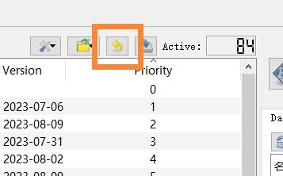

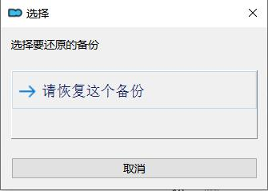

然后接着下一步——恢复预先准备的 MOD 排序的备份还原。

还原备份操作如下：点击"配置档案"栏，确认此时选择的"诺文斯克潜行者118"的档案：

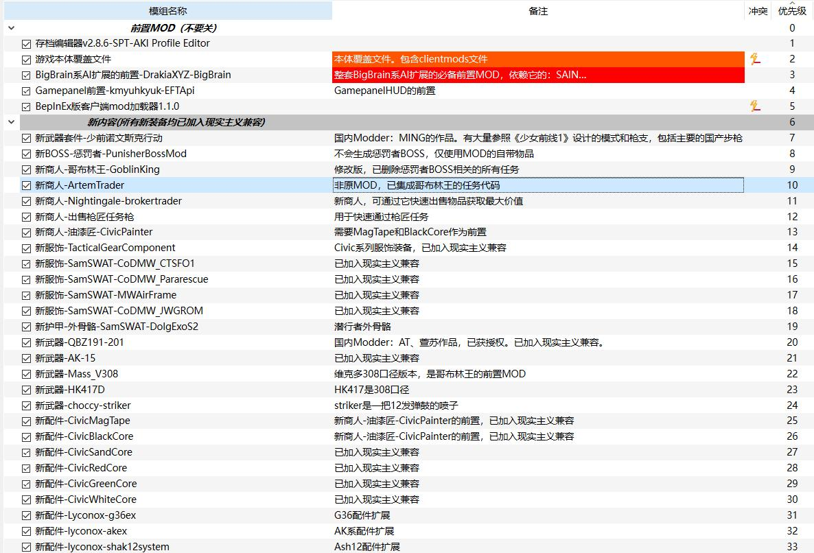

然后：

点击以上高亮的黄色箭头，会出现以下界面，点击唯一一个选项。

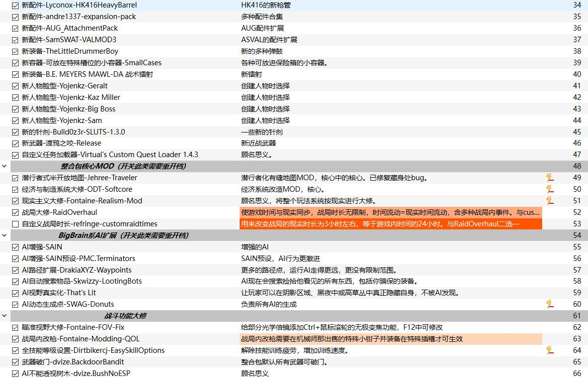

便可还原排序，还原后的排序列表如下可供对比：

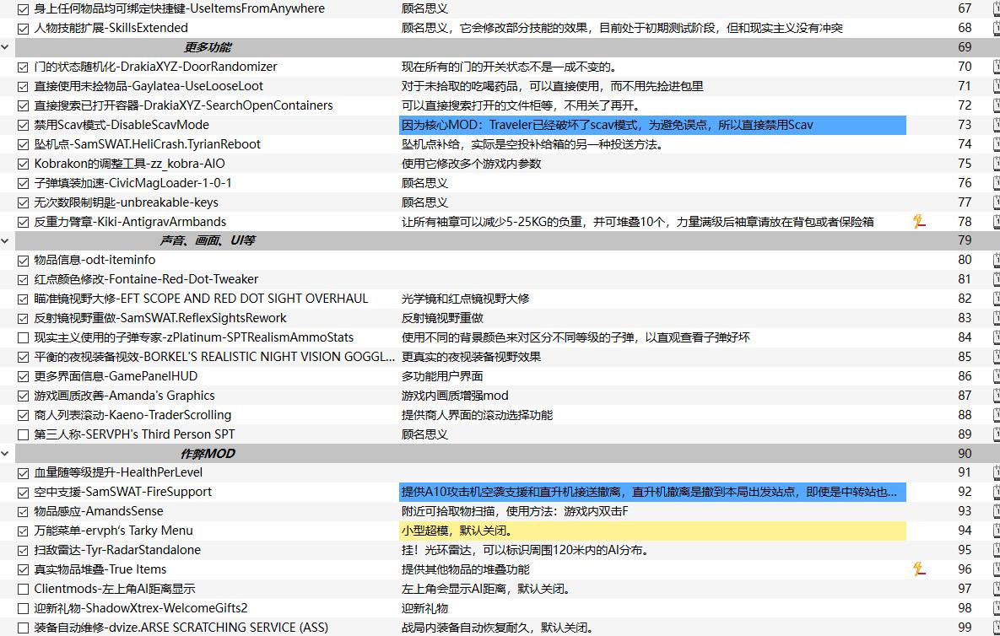

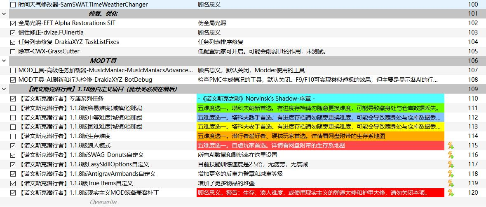

注意：难度设置默认勾选了"生存难度"，请自行重选你想玩的难度。

#### 八、启动游戏

完成上面操作后，请再检查一下"运行"旁边的路径——

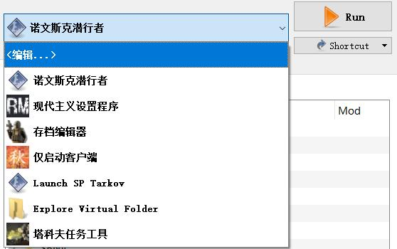

这里点击"编辑"打开以下窗口——

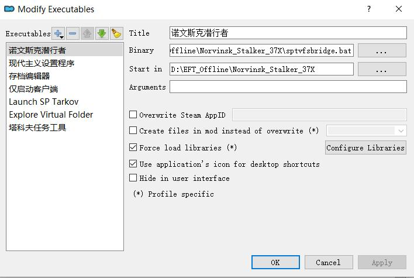

确保"程序"的路径指向你游戏本体里的 `sptvfsbridge.bat`。

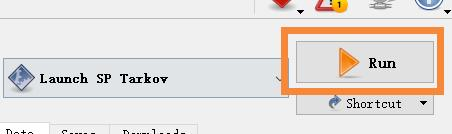

确保"启动于"的路径指向你的游戏本体的路径。

两个都确保以后，点击 MO2 界面的"run"会自动依次运行离线塔科夫的服务器端：

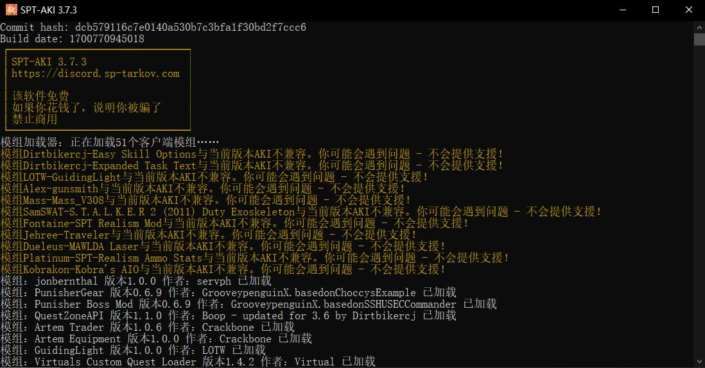

服务器加载时的大段黄字不用在意，仅因为部分 mod 没有更新到 3.7.6，不影响游玩。

客户端如下：

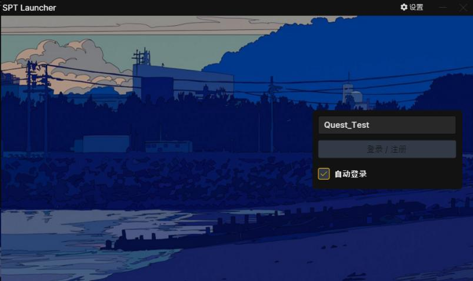

注：如果首次启动游戏，出现以下提示,请安装网盘中"0、【非正版玩家才用】前置系统环境软件"里的软件，如 `windowsdesktop-runtime-6.0.4-win-x64.exe`：

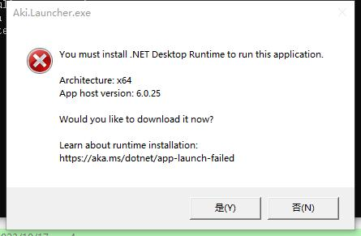

118 版本自带一个存档，也可自行新建存档。

在"电子邮箱"一栏随便输入你喜欢的命名，例如：

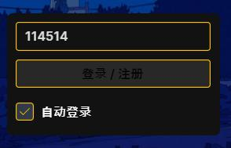

并点击"登录/注册"便可创建账号。

这时候会问你选择哪个版本，这些选项决定人物的出生装备多寡：

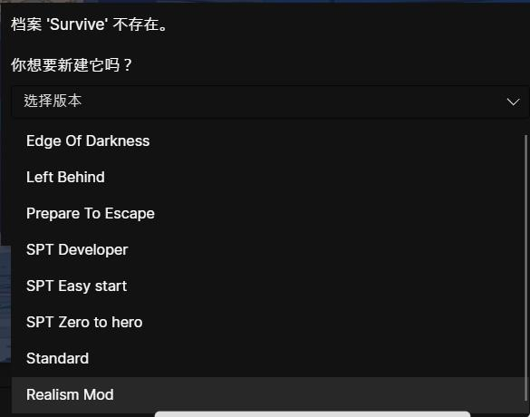

- Edge Of Darkness = 正版黑边
- Zero to Hero = 零物品全裸开局
- Standard = 正版白边
- Realism Mod = 本版本新核心 mod：现实主义提供的另一个开局模式

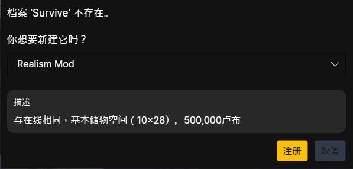

选择了一个版本后即可点"注册"开启存档，然后进入以下界面：

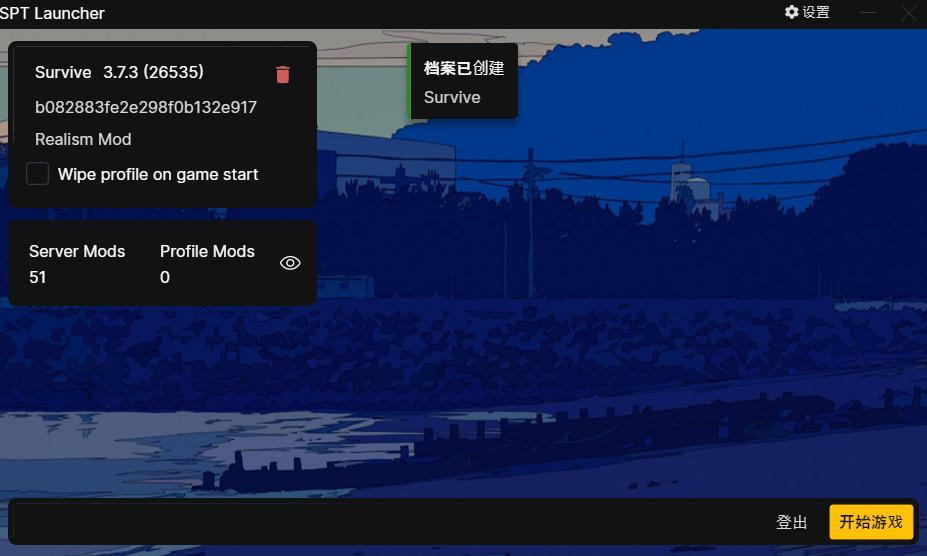

此时还不能直接按"开始游戏"，先点击右上角"设置"

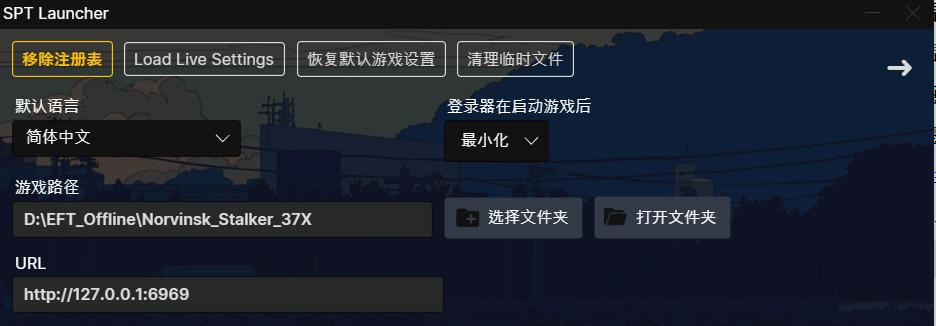

通过"选择文件夹"将路径定位到你的：`E:\EFT_Offline\Norvinsk_Stalker_376` 文件夹后，再重启客户端、服务器端，才可开始游戏。

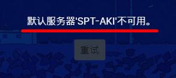

温馨提示：如果你的电脑配置较差，服务器开启较慢。SPT Launcher 启动后，服务器端可能并未启动完成，就会显示"默认服务器'SPT-AKI'可用"。

请在服务器端显示"服务器正在运行 玩得开心！！存档变动已保存"之后再点客户端上的"重试"就可以正常启动客户端了。

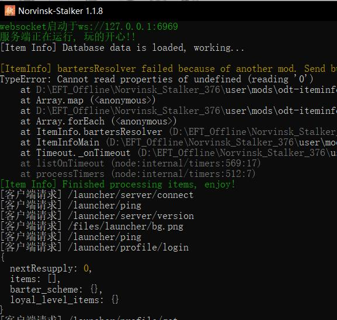

（进QQ群暗号密码：NJT 没有妈咪）

然后点击"开始游戏"————

尽情游玩吧

（遇到问题请先看下面的技术问题解答集）

## 整合包技术问题解答集

1. 点击"开始游戏"显示 Patching 开不了游戏。该问题原因推断 MO2 的 Overwrite 机制跟塔科夫本体十分合拍导致，可以按以下方式轻松解决：

   1.1. 重启电脑

   1.2. 或等服务器窗口显示"存档变动已保存"后再点击开始游戏。

   1.3. 或登出你的游戏账号，重启游戏客户端和服务器端，再重新启动两个端，如果此时客户端账号登入状态，则再登出一次，再登入，即可解决。

2. 关于游戏 mod，如想开关列表里的 MOD，在该页面打勾消勾即可（部分特殊 MOD 除外）

3. 修改本体却不生效。本整合包大多数内容均受到 MOD 的干预，本体修改不生效大概率因为已经有 mod 覆盖。请先确认自己需要的修改是否有 mod 可以实现。

4. 想安装其他 MOD。请看我的 B 站的 MO2 安装 MOD 教学视频：

   [https://www.bilibili.com/video/BV1nV4y1i7CH/](https://www.bilibili.com/video/BV1nV4y1i7CH/)

   [https://www.bilibili.com/video/BV1Ux4y1o7pX/](https://www.bilibili.com/video/BV1Ux4y1o7pX/)

5. Traveler 自带存档备份功能，如何使用请看我的 B 站教学视频：

   [https://www.bilibili.com/video/BV16N4y197eK/](https://www.bilibili.com/video/BV16N4y197eK/)

6. 如想下载更多 Mod，请去离线塔可夫论坛搜索查看——

   [https://hub.sp-tarkov.com/](https://hub.sp-tarkov.com/)

   [https://sns.oddba.cn/](https://sns.oddba.cn/)
