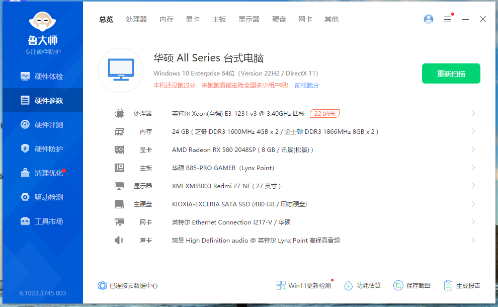

# Samuel是不是好奇猫整合包通用安装、技术手册

## 安装前必读事项：

> [!NOTE] 
> 
>  #### 一、整合包玩家必须要做内存管理
>  
> 1. **原因**：离线版塔科夫SPT需要玩家电脑同时运行服务器端和客户端，同时我的整合包包含极大增加系统负担的AI类和玩法改进MOD，所以实际上比在线版更吃系统资源，内存要求也比在线版更多。
> 2. 为了防止玩家出现爆内存闪退的情况，游玩前请先做好这两个措施：
> 
>	- 措施一. ==必须将虚拟内存大小设置为你物理内存的1到1.5倍。==即使电脑有128g物理内存也一定要开虚拟内存，哪怕是默认设置！设置方法B站自寻。
>	
>	- 措施二. ==必须安装一个内存管理软件==：ProcessLasso或Memreduct均可，第一个没效果则用第二个。我个人使用前者，内存清理推荐设置参数如下——
>		ProcessLasso：
>			
>			
> #### 二、整合包存档路径
> 整合包存档位置，共备份两个文件夹：
> (1) 你的存档文件在：Mod文件夹\\overwrite\\user\\profiles整个文件夹。
> (2) 你自己的游戏设置在：Mod文件夹\\overwrite\\user\\sptsettings整个文件夹。
> 
> #### 三、其他注意事项
> 
> 1. 安装游戏前请先安装网盘中，安装“0、【非正版玩家才用】前置系统环境软件”中的几个系统环境软件：
> 	
> 2. #### 所有整合包都均由3个压缩包构成：MO2程序/MOD文件夹/游戏本体。这三者所有安装路径均不可以使用中文，且文件夹堆叠不宜超过三层文件夹导致路径太长。
> 3. 请不要擅自修改本体里的SPT.Launcher.exe和SPT.Server.exe的文件名，这样会导致mo2无法识别游戏。
> 4. 所有整合包均使用压缩软件：**Bandizip**压缩，推荐使用同款软件解压，否则mo2可能出现**备注有乱码**，可能因为压缩编码问题，本软件安装包已放在网盘的“0、【非正版玩家才用】前置系统环境软件”文件夹中。
> 5. 不同整合包的网盘里都附带有对应的SPT版本本体，请按照教程下载解压使用。**注：分卷包是指zip、z01-z05共6个文件都要下载，解压仅需解压zip即可。**
> 6. 如果不懂安装，请遵循本技术手册中的安装教程安装整合包，不要跳过任何一步。**本教程部分配图使用旧版本的截图，但道理相通，就不改了。**
> 7. 《诺文斯克潜行者》和《生活在诺文斯克》整合包多个核心MOD与SVM和MGMOD存在大量功能冲突，非常不建议一起食用。
> 8. 如果你懂得使用MO2并有一个已经在使用的MO2，也请使用我网盘中的MO2程序覆盖你的MO2，因为我提供的MO2带有塔科夫的识别插件。
> 9. ###### 为什么要使用MO2作为整合包的载体，可阅读这篇文章：[为什么用Mod Organizer2来做塔科夫整合包？](为什么用Mod%20Organizer2来做塔科夫整合包？.md)
> 10. ##### ==对整合包进行任何自行改动之前，你都要知道自己在做什么。==
> ### 整合包最低配置要求（中心区40帧）：
	>CPU：Xeon E3-1231 v3@3.4Ghz
	>内存：24G ddr3 1600MHz
	>显卡：AMD RX580 8G
	>硬盘：必须固态硬盘
>

## 安装流程：

- ### 下载整合包指引
	- 本教程适用于我的三个整合包版本：
		- 《诺文斯克潜行者》：[1.Norvinsk Stalker.v.1.2.0 Download](../{0}ModPack%20Download/1.Norvinsk%20Stalker.v.1.2.0%20Download.md)
		- 《生活在诺文斯克》：[3.Live in Norvinsk download](../{0}ModPack%20Download/3.Live%20in%20Norvinsk%20download.md)
		- 《独享的塔科夫》：[4.Exclusive Tarkov download](../{0}ModPack%20Download/4.Exclusive%20Tarkov%20download.md)
	
	所有整合包现在包含三个压缩包：
		
	
	我们

- ### 创建实例

	- 以上步骤——下载游戏本体和做正版验证确认完成后，打开E:\\EFT_Offline\\Realized_Norvinsk_v0.9x，运行里面的ModOrganizer.exe，便可打开MO2。

	2. 如果直接照抄我上面的实例路径（即盘符、文件夹、路径全部一致），打开MO2后看到的界面应该是下图所示，等于MO2直接读取了我包中已有的实例。可**跳到第五步**之后，继续操作。

	3. 如果没有使用我上面的实例路径，MO2应该会提示以下错误，这表示MO2没找到可识别的实例，这里只需要按“确定”即可跳到创建实例的步骤。
		1. 
		 
	4. 创建实例窗口，点击（1）开始创建实例：
		
	
	5. 出现的以下窗口中，这两项均可，因为要设置的路径都是一样的：
		
	
	6. 下一个窗口中，选择（1）：
		
	
	7. 这里选择的是游戏本体的路径：
		
	
	8. 下一步出现的这个窗口中不用改动任何东西，因为选不选不会有任何影响。
		
	
	9. 下一步窗口设置的是MO2所在的路径：
		
	10. 接下来这两个窗口不用管直接过，就finish安装完成了：
		
		
	11. 点完上面的finish完成就会重启，以下界面宣告着实例创建成功：
		
- #### 必须做的设置
	- 在游玩之前，还要做必要的设置。
		- 先改设置换成中文界面tools-settings-Chinese(Simplified)然后OK即可
		-
		2. 必须做：这一步必须做**将MOD列表中的备注拉出来**——右键黄框一栏，按如图所示将“备注”开启，我在备注中添加了大量说明信息。
		- 
		3. 然后接着下一步——恢复预先准备的MOD排序的备份还原。还原备份操作如下：点击“配置档案”栏，确认此时选择的是“现实化诺文斯克vX.x.x”的档案：
		

 - #### 恢复MO2备份
		 
	1. 点击以下高亮的黄色箭头，会出现以下界面，因为我已根据不同需求，提供了三个不同的排序备份，请按你的实际情况选择备份恢复。
		
		
	2. 安装流程到这里，点击“运行”就可以打开游戏了。但在开始游戏之前，我推荐进行一下一些设置，方便你后续的游玩和游戏中设置。
		

## 游玩前检查和设置：

- #### 检查
	- 需要检查一下“运行”旁边的路径，这里点击“编辑”打开以下窗口——
		
	- 确保“程序”的路径是指向你游戏本体里的sptvfsbridge.bat。确保“启动于”的路径是指向你的游戏本体的路径。
	- 
		
		
	- 两个都确保以后，点击MO2界面的“运行”会自动依次运行离线塔科夫的服务器端：
	- 
		
		
	- 然而此时还不能直接按“开始游戏”，先点击右上角“设置”：
		
		
		确定了“选择文件夹”项的路径是你游戏本体路径，如：E:\\EFT_Offline\\SPT_39x文件夹后，再重启客户端、服务器端，才可开始游戏。
		
	- **温馨提示：如果你的电脑配置较差，服务器开启较慢。SPT Launcher启动后，服务器端可能并未启动完成，就会显示“默认服务器‘SPT-AKI’不可用”。**
		
		
	- 请在服务器端显示“**服务器正在运行 玩得开心！！**”之后再点客户端上的“重试”就可以正常启动客户端了。
		
		
		
	- 可自行新建存档。在“电子邮箱”一栏随便输入你喜欢的命名，例如：
		
		
		##### 并点击“登录/注册”便可创建账号，开始游戏。

## 特别鸣谢

### 汉化、翻译：Volcano对MOD的一系列汉化补丁制作工作及使用授权：
他的ODDBA论坛主页：
https://sns.oddba.cn/139847.html
### **Q群群友:**
诺文斯克潜行者1.0.0版教程的修正：随风而去
1.0.0版整问题反馈：珠泪哀歌族·？
1.0.0版大地图汉化：出走在远方
“点开始游戏却没有反应”的解决方案：夜熙、夢遊于華胥之國、旗礼、BadForNight
Traveler商人位置修改补丁的制作和测试：KHORNE制作，树上骑柒只猴
制作对应的实时地图修改：树上骑柒只猴
1.0.5版新traveler大地图指引制作：风吟随行
1.0.5版测试人员：珠泪哀歌族·？、那我就特别凶、恰啡就是咖啡、憨伍蒂
1.1.0版测试人员：T1anMen9、Niegerlia、Rivaille、E_lizard、加把劲骑士、Kang、Weeping Dawn
1.0.0热修鸣谢：Kang、E_lizard、B站UP：Oo大H豆oO、刀刀
1.1.8版测试人员：一只梅狸猫、公用带星怒、随风而去、童某、悲剧龙
现实化诺文斯克制作过程中：渗透者之心的物价建议、✘✘✘✘的任务文本翻译、颜开的起始角色建议。

### 离线塔科夫MOD社区
塔科夫 MOD 社区网站：https://hub.sp-tarkov.com/files/
国内塔科夫 MOD 社区 ODDBA：https://sns.oddba.cn/

本整合包所使用的每个MOD的主页列表：
[6.List of the mod used in Realization Norvinsk](../{0}ModPack%20Download/6.List%20of%20the%20mod%20used%20in%20Realization%20Norvinsk.md)

说明手册借鉴自：

B站up主BB84 的辐射 4 整合包《废土蓝调》:
https://www.bilibili.com/video/BV1z54y1Z7hv/

### 谨以此整合包纪念我的两只爱猫

- 大头（左）：2024年3月11日
- 灵灵（右）：2024年3月13日

