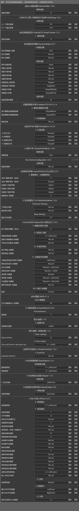

# 《生活在诺文斯克》-Live in Norvinsk-游戏手册

> [!NOTE]
> #### 整合包信息：
> 《生活在诺文斯克》Live in Norvinsk整合包是基于SPT3.11.x制作，开发阶段仅作为Q群内群友福利。
> 正式版将为v1.0.0，届时会正式对外发布，作为《诺文斯克潜行者》整合包1.1.8之后的全新重制的离线塔科夫整合包。
> 
> #### **特色简介**：
> 
> 而是在原版基础上通过Mod：PathToTarkov（PTT）进行地图间移动设置、CustomProfiles（自定义档案）增加专属起始角色、Realism（现实主义）进行更进一步现实化改造（《诺潜》已经有一定现实化改造了），加入整合包专属商人、整合包专属任务线，具备撬锁、枪破门、技能大改、医疗方式大修、AI行为拟人化、武器装备的数值重新平衡等等，提供区别于原版塔科夫的真实性沉浸式游戏体验。

### 整合包游玩简单须知

- 本整合包是**丹尼斯模拟器**！**丹尼斯模拟器**！
- 我的整合包普遍倾向于让玩家更多地通过在战局中拾取各种装备来武装和升级自己，而不是通过交易，即使是交易，也是以物易物为主，钱没那么重要。
- 你想被AI集体冲脸，可以试试不用消音器。
- 请关注生化毒素积累和辐射剂量积累。
	- **气体分析仪和盖革计数器可以放特殊插槽，他们警告你是否身处危险之地**。
	- 辐射超50要么去找大妈做要上交小黑的治疗任务，要么删档重开。
	- 善用AI2和蓝血针等。
- 战局内回血：手术包、黄绿等各种针、部分特定吃喝。
- 作弊MOD：
	- DadgamerMode
	
	
	- PlayerLives
	
- a/ifak 是药也是钱。
- 想折磨自己就别带防毒面具，记得防毒面具要放滤罐。而且尽可能保证面具满耐久。
- 所有门都可以用任何武器打开。
	- 也可以撬锁，有撬锁工具，可以跳蚤，或者做任务获取。
	- 也可以用传统钥匙，钥匙耐久无限。有C4炸弹可以炸门。选择你喜欢的开门方式。
- 动态地图需要身上带地图，信息显示情报站等级：
	- 

### 如何调整难度

#### 1.MO2中的游戏设定难度

整合包主要使用以上五个核心MOD的不同设置来实现四种难度，整合包默认是最难的生存难度，所以请开始游戏前选择自己的难度：
	
	各个难度的差异明细如下：
	

#### 2.不同开局也各有不同
整合包新增的四（五）种不同的开局角色，可以在新建档案的列表中找到它们：

#### 3.两套SAIN预设代表两种AI强度

黑色军团预设【Black Divisions_preset_for_SAIN413】：AI强度会相当高，默认也是它。
生活在诺文斯克预设【Live in Tarkov_preset_for_SAIN413】：AI强度较弱，反应速度和视野都较弱，AI比较呆。

### 整合包的特色玩法总结性介绍

- 《生活在诺文斯克》Live in Norvinsk倾向于单机化、RPG化和潜行者化。**主要差异通过5个核心MOD来实现与离线/在线版塔科夫是完全不同的游戏体验。**

- 目前整合包的五个核心MOD分别是：
	- [5]伪无缝地图-通往塔科夫之路-Trap-PathToTarkov
	- [5]经济与制造系统大修-ODT-Softcore
	- [5]现实主义大修-Fontaine-Realism-Mod
	- [5]以物易物经济系统-barter_economy
	- [5]自定义档案-ShadowXtrex-CustomProfiles

- [5]伪无缝地图-通往塔科夫之路-Trap-PathToTarkov
	- 是我曾经使用的 Traveler的平替，出过说明视频：
	- Traveler说明：https://www.bilibili.com/video/BV1MP411x7bg/，这个MOD的说明视频会在之后更新。
	- 这个MOD提供了类潜行者地图的伪无缝地图间移动功能，整合包的整个地图自定义设计就是由它实现的。所以它也是本整合包的最重要的MOD。
	- 目前整合包的地图间移动路径如下图：

- [5]经济与制造系统大修-ODT-Softcore
	- 说明：https://www.bilibili.com/video/BV1W8411Q7h8/
	- 译作软核，它提供了对游戏经济系统的RPG化修改，去除了大部分NJT为了线上运营设计的限制，并实现了更多适合单机游玩的机制。
- [5]现实主义大修-Fontaine-Realism-Mod
	- 说明及服务器端设置（主要的功能模块开关都在这）：[https://www.bilibili.com/video/BV1de411v7bi/](https://www.bilibili.com/video/BV1de411v7bi/)
	- 客户端设置（F12设置，细分设置在这）：[https://www.bilibili.com/video/BV17x421U7Af/](https://www.bilibili.com/video/BV17x421U7Af/)
	- 治疗方式演示：[https://www.bilibili.com/video/BV1CA4m1F7DX/](https://www.bilibili.com/video/BV1CA4m1F7DX/)
	- 译作现实主义，对整个塔科夫战斗系统进行了大修。让塔科夫的游玩体验更加偏真实。
	- 治疗系统补充说明：生存难度、浪人模式时治疗系统大修打开，战局内会无法使用药包加血，药包只能止血和自动恢复少许血量，想要在战局内回满血量，请自备各类针剂和我修改过的部分吃喝（如热棒、士力架、巧克力板、酒类等）。
	- 请时刻关注生化毒素和辐射剂量的积累，**气体分析仪和盖革计数器可以放特殊插槽，他们警告你是否身处危险之地**。辐射不可以超60，否则要么去找大妈做《紧急治疗》任务，要么删档重开，所以请善用AI2和蓝血针等针剂。
	- 高危地带**一定要戴安装有满耐久滤罐的满耐久防毒面具**，并保持面具不要破损。
	- 我已经使用现实主义的弹道大修系统，对mod和游戏的默认数值进行了重新调整，数值设置思路按这篇文章：[[现代单兵武器中不同零部件对武器的好坏影响]]
	- 现实主义的各属性的作用看这个：[现实主义“Realism”装备补丁制作说明](主要的MOD使用、设置指南/现实主义“Realism”装备补丁制作说明.md)
- [5]自定义档案-ShadowXtrex-CustomProfiles
	- 说明：请看这篇文章：[《生活在诺文斯克》Live in Norvinsk的四种专属角色简介](《生活在诺文斯克》Live%20in%20Norvinsk的四种专属角色简介.md)，从0.9.5测试版起，它和[5]伪无缝地图-通往塔科夫之路-Trap-PathToTarkov一起为整合包玩家提供四种不同的开局角色体验：

### 物品自动分类功能说明

@o  整理。使容器拉入标签指定的物品种类和物品。
可以多个标签，请确保用空格分隔它们。

示例：
@o
@o money;
@o后面有分类的话要跟英文分号(;)

@o标签的使用方法：
示例：@o categoryParam1|n:nameParam1|--fir;
categoryParam1：指物品详情页面的左上角的分类，如果在前面加英文感叹号!则表示不放这类物品。
n:nameParam1：指名字中包含指定内容的物品。
--fir：指仅放打勾物品。
例如：@o muzzle devices|n:suppressor|--fir 意思是指定该容器只能放打勾的名字中带suppressor的枪口零件

以下是我自用的标签模版，供参考，不懂自行设置的可直接复制，分语言使用：
中文：
物品箱、THICC物品箱：
（头盔、耳机、夜视仪）@o 头饰&头盔|耳机|特种瞄具|!弹匣; 
（武器零件，别放弹匣）@o 武器零件&配件|!弹匣; 
（面罩、臂章、近战武器）@o 面具&面罩|装备组件|近战武器|地图|!弹匣; 
钱箱：@o 钱; 
弹匣箱：@o 弹匣; 
子弹箱：@o 子弹; 
武器箱/THICC武器箱：@o 武器;
狗牌包：@o n:狗牌;
钥匙扣：@o 机械钥匙
卡片夹：@o 电子钥匙;
药品箱，不放针剂：@o !注射器; 
药品箱，专门放针剂：针剂 @o 注射器 ;
手雷箱（不知道是不是bug，手雷箱不能用多重标签）：@o 投掷物;
垃圾箱，也放特殊物品：@o 交换用物品|特殊装备;
垃圾箱：@o 交换用物品;
食物箱，放喝的：喝 @o 饮品; 
食品箱，放吃的：吃 @o 食品; 

------
英文：
物品箱、THICC物品箱：
（头盔、耳机、夜视仪）@o headgear|headsets|special purpose sights|!magazines;
（武器零件，别放弹匣）@o weapon parts & mods|!magazines;
（面罩、臂章、近战武器）@o facecovers|gear components|melee weapons|maps|!magazines;
钱箱：@o money;
弹匣箱：@o magazines;
子弹箱：@o ammo;
武器箱/THICC武器箱：@o weapons;
狗牌包：@o n:dogtag;
钥匙扣：@o keys
卡片夹：@o electronic keys;
药品箱，不放针剂：@o !injectors;
药品箱，专门放针剂：针剂 @o injectors ;
手雷箱（不知道是不是bug，手雷箱不能用多重标签）：@o throwables;
垃圾箱，也放特殊物品：@o Barter items|special equipment;
垃圾箱：@o Barter items;
食物箱，放喝的：喝 @o drinks;
食品箱，放吃的：吃 @o food;

### 本整合包必须知道的快捷键

### 整合包核心MOD：现实主义-Realism指南

#### 现实主义设定程序的启用方式

现实主义有服务端/客户端两种配置方式，服务端配置程序需要在游戏外开启配置：
在MO2的右栏“数据”中展开user\mods\SPT-Realism文件夹即可发现Realism-Mod-Config-GUI.exe：

右键它，选择“添加到可执行程序”即可添加进启动列表，可在mo2中启动：

即可将现实主义的配置程序添加到MO2的启动程序列表中。
运行后即可按照自己想法设置现实主义的服务端模块

**特别感谢Volcano授权我使用他的汉化作品

对于本现实主义设置程序中的主要模块的功能介绍，请观看我这个视频：
[https://www.bilibili.com/video/BV1de411v7bi/](https://www.bilibili.com/video/BV1de411v7bi/)

#### 现实主义MOD-弹道大修说明：

整合包已经默认启用了现实主义中的弹道大修，并尽可能参照维基百科的现实数据对现实主义原版默认的所有武器/配件/部分子弹数值进行了重新调整。

上图：现实主义的护甲防护区域

#### 护甲概述：

整合包中，护甲等级显示为现实中的护甲等级。如果你想知道它应该能阻止什么，可以查找该护甲分类来了解情况：[https://en.wikipedia.org/wiki/List_of_body_armor_performance_standards](https://en.wikipedia.org/wiki/List_of_body_armor_performance_standards)

游戏内对应的现实护甲等级对于塔科夫的护甲等级

|         |                                                            |
| ------- | ---------------------------------------------------------- |
| **1**   | NIJ I                                                      |
| **2**   | GOST 1                                                     |
| **3**   | NIJ IIA / PM 2                                             |
| **4**   | NIJ II / GOST 2 / PM 3                                     |
| **5**   | NIJ IIIA / GOST 2A                                         |
| **6**   | **GOST 3 / PM 5**                                          |
| **7**   | **NIJ III / GOST 4 / PM 8**                                |
| **8**   | **NIJ III+ / GOST 5 / MK4A Plates / ESAPI (Rev. G)**       |
| **9**   | **NIJ IV / GOST 5A / ESAPI (Rev. J) / PM 10 / NIJ RF3 07** |
| **10+** | **GOST 6 / XSAPI**                                         |
**注：****细体字：手枪可击穿****/****加粗：步枪才可击穿**

**护甲材质****耐久与****等级表****：**

|              |                   |               |
| ------------ | ----------------- | ------------- |
| **护甲****材料** | **与现实对应****的材料**  | **相对耐久****度** |
| 护甲钢          | 钢板，几乎坚不可摧         | 很高            |
| 泰坦           | 金属和凯夫拉或芳纶做衬底      | 高             |
| UHWMPE       | 高密度聚乙烯，轻便，耐用      | 高             |
| 复合材料         | UHWMPE+陶瓷，两全其美的材料 | 中高            |
| 陶瓷           | 陶瓷，耐久低，钝伤低        | 中低            |
| 芳纶           | 软护甲，仅适于防护霰弹或手枪    | 低             |
| 玻璃           | 耐久很低，但坏之前几乎没钝伤    | 很低            |

钢制护甲将具有非常高的耐久度，以抵消所有子弹造成的最低耐久度损失。钢板几乎应该是坚不可摧的，因此为了防止子弹像对其他护甲那样将其融化，钢板被赋予了很高的耐久性。但由于钢板可承受极高的钝器伤害，因此抵消了这一影响。

现在有 10 个护甲等级，分别代表美国 NIJ 和俄罗斯 GOST 装甲等级。这并不精确，但已接近 BSG 的任意系统。在塔科夫原版中，1-6 系统不足以真实地代表相对的装甲性能。1-5 可以阻挡手枪和霰弹枪子弹。5-7 可以阻挡高笔数手枪和霰弹枪子弹，以及低笔数步枪子弹。7-8 可以阻挡大部分中等笔尖的步枪子弹。9-10 可阻挡大部分步枪子弹，但高倍镜/终极子弹除外。如果您了解现实生活中的装甲等级，请参考下表：

#### 弹药：

**弹药属性已完成重做，以尽量模拟这些子弹在现实生活中的性能。**

现在，几乎所有步枪子弹都能穿透手枪级装甲，包括 HP 子弹。AP 9x19 和 .45 将不再适用于步枪级防弹衣，4.6 毫米和 5.7 毫米的穿透力也不再优于步枪子弹。现在，7.62x51 毫米等大口径子弹比 5.56x45 毫米等中口径子弹更有威力，更能可靠地击倒敌人。

#### 武器/配件：

整合包中的几乎所有武器以及配件的数值已经完全重制，原现实主义原版的数值完全不同，修改逻辑看这篇文章：[现代单兵武器中不同零部件对武器的好坏影响](现代单兵武器中不同零部件对武器的好坏影响.md)
是的，现实主义原版的数值并未严格依照现实配件作用设置。

**枪管长度/枪口速度：**

枪管长度现在会影响子弹的伤害、穿透力、破片几率、弹道系数、穿甲伤害和钝器穿甲伤害。您可以使用枪管的速度属性来确定这些属性的或多或少的减少量。每英寸枪管长度的速度损失/增加量取决于口径。例如，7.62x39 的枪管较短，速度损失不大，而 5.56 的枪管较长，速度损失很大。

损耗/增益的百分比是与该口径的 "标准 "枪管长度进行比较的，而 "标准 "枪管长度是以该口径通常被认为的最佳枪管长度为基础的。这意味着弹药统计信息只对标准枪管长度有效，任何更长/更短的枪管长度都会改变统计信息：

**射击命中率 (STK)：**

射击命中率现在在很大程度上取决于射击命中的位置（请参阅上文有关新命中区域的视频）。手枪子弹需要 1-7 发，取决于击中胸部的位置和子弹的种类。中间步枪子弹需要 1-4 发，全威力子弹需要 1-2 发。

说到护甲，头盔能提供实际的保护水平，因此除了幸运跳弹外，大部分护甲不再能抵挡步枪子弹。一般来说，防弹衣的防护能力要强得多。

**后坐力和精度统计：**

现在，子弹的后坐力统计反映了其能量输出和压力。与 "标准 "子弹相比，+P 9x19 子弹的后坐力会明显增加。与未修改的 EFT 不同，后坐力统计现在也会影响散射和镜头后坐力。

不同的子弹还会改变武器的射速。一般来说，射速的变化约为后坐力状态的一半。

与未修改的 EFT 不同，精度状态现在会影响霰弹的散布/扩散。

霰弹现在有符合实际的弹丸数量（8 至 27）。

#### 治疗系统：

##### 医疗物品：

**医疗包**不再在战局中直接恢复生命值，它们主要用来消除流血和骨折。治疗流血会将流血所造成的伤害量恢复到全身最大限度（由活力技能决定）。治疗骨折会恢复该身体部位的一定生命值。
**医疗包**在战局之外仍会恢复生命值。
无论是否变黑，**手术包**都会恢复所用身体部位的生命值，最多恢复到原始部位生命值的 50%。它现在可以恢复变黑的头部和胸部。
**止血带**（CAT、Esmarch）不能用在胸部、腹部或头部，会慢慢减少所用肢体的生命值。使用**凝血剂**（CALOK）来止住胸部、腹部或头部的大量出血。手术包和一些刺激物会消除止血带的效果。大多数医疗包在四肢上使用时会起到止血带的作用，在其他地方使用时会起到凝血剂/胸腔密封剂的作用。
装备将阻止治疗。例如，如果你胸部出血，你必须脱下护甲和背包才能治疗。如果是这种情况，游戏内通知会提醒你。有一个键绑定（默认为双击 P）可以移除所有阻碍治疗的装备。
使用面罩和夜视镜情况下，会阻止你进食/饮水/服用药丸。你必须关闭它们或移除物品。
头部、腹部和胸部的骨折无法在突袭中治愈。
一段时间后，具有止血带效果的肢体上的重度和轻度出血会自动消除。
如果身体部位在一段时间后也出现重度出血，轻度出血也会自动消除。
##### 生命值大修：

剩余 % HP、能量和水分都会影响几乎所有动作的速度、移动速度和武器后坐力。
腿部和胸部受伤会减慢行走和冲刺速度和加速度，手臂受伤会减慢 ADS 和重新装填速度。
剩余能量 % 会直接减慢所有动作和移动速度，而水分损失会影响 HP 和能量可以降低这些速度的最大量。
剩余 % HP 会影响能量和水分损失的速度。
剩余 % 体力会影响重新装填、瞄准和姿势速度。
脱水、疲惫和轻微出血不再会杀死玩家，而是会将玩家的 HP 降低到 X% HP 阈值。
如果您被射击/射击或受到近战伤害，您会获得“肾上腺素”效果。这会增加止痛效果、隧道视野和震颤。效果的持续时间和冷却时间受压力抵抗技能的影响。此技能可减少隧道视野和震颤强度及持续时间。

##### 有限的被动生命值再生：

对于一般的被动再生，默认情况下，您必须在 10 分钟内未受到任何伤害，水分和能量接近满，未处于任何负面状态影响，不得冲刺，不受危险区域影响，并且仅适用于生命值超过 90% 的身体部位。 剩余生命值、水分/能量和时间阈值会因活力和健康技能而大大降低。 新帐户实际上没有被动再生能力，而完全升级的帐户将具有显着的被动再生能力。
还有特定于伤害的再生。 您还将随着时间的推移从每条腿不超过 12 HP 的坠落伤害、75% 的铁丝网伤害和不超过 4 HP 的钝器伤害中再生生命值。 任何新的坠落伤害或钝器伤害都会抵消任何先前相同类型的主动被动再生效果。
通过饮水/进食消除脱水/疲劳效果将恢复因这些效果而损失的所有生命值，除非您再次脱水/疲劳。
如果玩家被枪击、被爆炸物伤害或跌倒造成超过 16 点生命值的伤害，所有主动生命值再生效果都将被取消，包括使用医疗物品治疗伤口的效果。
疼痛机制：
不同的止痛药具有强度等级，如其状态菜单中的“止痛强度”所示。不同的伤害会导致不同程度的疼痛（50% 生命值、肢体发黑、骨折），您拥有的止痛药越多，就需要更强的止痛药。您不能只吃一片布洛芬来忽略骨折。
止痛药有延迟，它们的止痛效果是间歇性的，有一段时间没有止痛效果。药物越强，延迟越少，止痛时间越长。
止痛药可以堆叠，因此您可以吞下一瓶布洛芬来抵消更严重的伤害。但是，它们的负面影响（例如视野狭窄）也会叠加，服用过多会导致过量并产生各种减益效果。

##### 针剂大修：

针剂已重新平衡，风险回报更高，更具体。所有刺激物都有各种副作用，这些副作用在增益效果消失后开始出现。
针剂现在可以叠加，包括增益效果和减益效果。但是，在第一个刺激物仍处于活动状态时服用 2 种相同类型的刺激物会导致过量服用。过量服用效果会根据刺激物的类型而变化。刺激物的类型显示在检查菜单中。
##### 食物和饮料：

现在能量和水分会随着时间的推移而恢复，而不是立即恢复。恢复量和额外的增益效果/减益效果已重新平衡。
塔科夫多年来一直是战区，您找到的大多数商品很久以前就变质了。有些食物有小概率会产生毒素效果，但可以通过 Augmentin、AI-2 或解毒剂刺激来抵消。
小心饮食！有些食物是干净的，保质期很长，所以仍然可以安全食用。含糖食物可以大大增强能量，但随着血糖下降，你必须随着时间的推移偿还。
食物和饮料会叠加所有增益和减益效果。

#### 污染区说明：

塔科夫地区到处都是环境污染、有毒废物、放射性和危险物质。有人说，在导致契约战争的事件混乱中，该地区成为了泰拉集团的垃圾场。

有随机的有毒气体区域，会毒害并最终杀死玩家和 AI。辐射区有固定的生成点，杀伤速度慢，但只能在有限的程度上进行治疗，导致高水平辐射中毒时近乎永久死亡。有用于检测、预防和治疗污染的工具和手段。随着时间的推移，将添加更多区域、机制和功能。

毒性可以用某些药物完全治疗，而辐射只能在有限的程度上进行治疗。如果辐射低于 30，则可以完全治疗。如果高于 30，则只能治疗到下一个最低的 10 倍数，或者通过完成治疗师提供的任务来治疗。如果你不小心，不及时治疗，辐射会永久地削弱你的角色，并最终导致你的角色生命力下降。这也适用于你的玩家 scav。是的，毒性和辐射会在整个 scav 突袭中传播。
### 如何在MO2中启动存档编辑器

在MO2的右栏“数据”中找到下图的1️⃣展开，右键2️⃣，再点击3️⃣：

再输入名称，或者不改也可，按确定：

即可在MO2的启动程序栏里添加存档编辑器的启动方式：

第一次在MO2启动存档编辑器时，可能会有无法识别存档的情况，需要你在编辑器的设置里设置路径，将“SPT服务器器目录”设置为塔科夫本体的路径，然后点关闭即可：
![[assets/Pasted image 20250320190319.png]]

## 可为我充电

## 特别鸣谢

小火山授权我使用他的所有mod：
	[10]小火山的仓库搜索框修复和扩展-SearchBarExtended
	[9]小火山的全界面中文字体切换

**Q群群友:**
诺文斯克潜行者1.0.0版教程的修正：随风而去
1.0.0版整问题反馈：珠泪哀歌族·？
1.0.0版大地图汉化：出走在远方
“点开始游戏却没有反应”的解决方案：夜熙、夢遊于華胥之國、旗礼、BadForNight
Traveler商人位置修改补丁的制作和测试：KHORNE制作，树上骑柒只猴
制作对应的实时地图修改：树上骑柒只猴
1.0.5版新traveler大地图指引制作：风吟随行
1.0.5版测试人员：珠泪哀歌族·？、那我就特别凶、恰啡就是咖啡、憨伍蒂
1.1.0版测试人员：T1anMen9、Niegerlia、Rivaille、E_lizard、加把劲骑士、Kang、Weeping Dawn
1.0.0热修鸣谢：Kang、E_lizard、B站UP：Oo大H豆oO、刀刀
1.1.8版测试人员：一只梅狸猫、公用带星怒、随风而去、童某、悲剧龙
现实化诺文斯克制作过程中：渗透者之心的物价建议、✘✘✘✘的任务文本翻译、颜开的起始角色建议。
以及我群里的给我提供建议和意见的所有群友。

**充电粉丝：**

### 离线塔科夫MOD社区
塔科夫 MOD 社区网站：https://forge.sp-tarkov.com/
国内塔科夫 MOD 社区 ODDBA：https://sns.oddba.cn/

本整合包所使用的每个MOD的主页列表：
[6.List of the mod used in Realization Norvinsk](../{0}ModPack%20Download/6.List%20of%20the%20mod%20used%20in%20Realization%20Norvinsk.md)

说明手册借鉴自：

B站up主BB84 的辐射 4 整合包《废土蓝调》:
https://www.bilibili.com/video/BV1z54y1Z7hv/

### 谨以此整合包纪念我的两只爱猫

- 大头（左）：2024年3月11日
- 灵灵（右）：2024年3月13日

