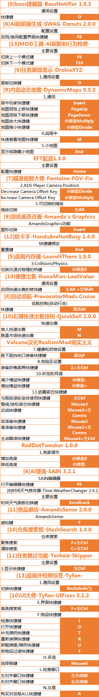

# 《生活在诺文斯克》-Live in Norvinsk-游戏手册

> [!NOTE]
> #### 整合包信息：
> 《生活在诺文斯克》Live in Norvinsk整合包是基于SPT3.11.x制作，开发阶段仅作为Q群内群友福利。
> 正式版将为v1.0.0，届时会正式对外发布，作为《诺文斯克潜行者》整合包1.1.8之后的全新重制的离线塔科夫整合包。
> 
> #### **特色简介**：
> 
> 而是在原版基础上通过Mod：PathToTarkov（PTT）进行地图间移动设置、CustomProfiles（自定义档案）增加专属起始角色、Realism（现实主义）进行更进一步现实化改造（《诺潜》已经有一定现实化改造了），加入整合包专属商人、整合包专属任务线，具备撬锁、枪破门、技能大改、医疗方式大修、AI行为拟人化、武器装备的数值重新平衡等等，提供区别于原版塔科夫的真实性沉浸式游戏体验。

### 整合包的特色玩法总结性介绍

- 《生活在诺文斯克》Live in Norvinsk倾向于单机化、RPG化和潜行者化。**主要差异通过5个核心MOD来实现与离线/在线版塔科夫是完全不同的游戏体验。**

- 目前整合包的五个核心MOD分别是：
	- [5]伪无缝地图-通往塔科夫之路-Trap-PathToTarkov
	- [5]经济与制造系统大修-ODT-Softcore
	- [5]现实主义大修-Fontaine-Realism-Mod
	- [5]自定义档案-ShadowXtrex-CustomProfiles
- [5]伪无缝地图-通往塔科夫之路-Trap-PathToTarkov
	- 是我曾经使用的 Traveler的平替，出过说明视频：
	- Traveler说明：https://www.bilibili.com/video/BV1MP411x7bg/，这个MOD的说明视频会在之后更新。
	- 这个MOD提供了类潜行者地图的伪无缝地图间移动功能，整合包的整个地图自定义设计就是由它实现的。所以它也是本整合包的最重要的MOD。
	- 目前整合包的地图间移动路径如下图：

- [5]经济与制造系统大修-ODT-Softcore
	- 说明：https://www.bilibili.com/video/BV1W8411Q7h8/
	- 译作软核，它提供了对游戏经济系统的RPG化修改，去除了大部分NJT为了线上运营设计的限制，并实现了更多适合单机游玩的机制。
- [5]现实主义大修-Fontaine-Realism-Mod
	- 说明及服务器端设置（主要的功能模块开关都在这）：[https://www.bilibili.com/video/BV1de411v7bi/](https://www.bilibili.com/video/BV1de411v7bi/)
	- 客户端设置（F12设置，细分设置在这）：[https://www.bilibili.com/video/BV17x421U7Af/](https://www.bilibili.com/video/BV17x421U7Af/)
	- 治疗方式演示：[https://www.bilibili.com/video/BV1CA4m1F7DX/](https://www.bilibili.com/video/BV1CA4m1F7DX/)
	- 译作现实主义，对整个塔科夫战斗系统进行了大修。让塔科夫的游玩体验更加偏真实。
	- 治疗系统补充说明：生存难度、浪人模式时治疗系统大修打开，战局内会无法使用药包加血，药包只能止血和自动恢复少许血量，想要在战局内回满血量，请自备各类针剂和我修改过的部分吃喝（如热棒、士力架、巧克力板、酒类等）。
	- 请时刻关注生化毒素和辐射剂量的积累，**气体分析仪和盖革计数器可以放特殊插槽，他们警告你是否身处危险之地**。辐射不可以超60，否则要么去找大妈做《紧急治疗》任务，要么删档重开，所以请善用AI2和蓝血针等针剂。
	- 高危地带**一定要戴安装有满耐久滤罐的满耐久防毒面具**，并保持面具不要破损。
	- 我已经使用现实主义的弹道大修系统，对mod和游戏的默认数值进行了重新调整，数值设置思路按这篇文章：[[现代单兵武器中不同零部件对武器的好坏影响]]
- [5]自定义档案-ShadowXtrex-CustomProfiles
	- 说明：请看这篇文章：[《生活在诺文斯克》Live in Norvinsk的四种专属角色简介](《生活在诺文斯克》Live%20in%20Norvinsk的四种专属角色简介.md)，从0.9.5测试版起，它和[5]伪无缝地图-通往塔科夫之路-Trap-PathToTarkov一起为整合包玩家提供四种不同的开局角色体验：
### 如何开局

上述新增的四（五）种不同的开局角色，可以在新建档案的列表中找到它们：

![[assets/Pasted image 20250318145756.png]]

### 整合包游玩简单须知

- 本整合包是**丹尼斯模拟器**！**丹尼斯模拟器**！**丹尼斯模拟器**！**丹尼斯模拟器**！**丹尼斯模拟器**！**丹尼斯模拟器**！**丹尼斯模拟器**！**丹尼斯模拟器**！**丹尼斯模拟器**！**丹尼斯模拟器**！**丹尼斯模拟器**！**丹尼斯模拟器**！**丹尼斯模拟器**！**丹尼斯模拟器**！**丹尼斯模拟器**！**丹尼斯模拟器**！**丹尼斯模拟器**！**丹尼斯模拟器**！
- 你想被AI集体冲脸，可以试试不用消音器。
- 请关注生化毒素积累和辐射剂量积累，**气体分析仪和盖革计数器可以放特殊插槽，他们警告你是否身处危险之地**。辐射超60要么去找大妈做要上交小黑的治疗任务，要么删档重开，善用AI2和蓝血针等。
- 战局内回血：手术包、黄绿等各种针、部分特定吃喝。要么把作弊MOD：DadgamerMode打开，他F12可以让你COD呼吸回血。
- a/ifak 是药也是钱。
- 想折磨自己就别带防毒面具，记得防毒面具要放滤罐。而且尽可能保证面具满耐久。
- 白色信号棒是你的移动仓库。它能召唤回收箱空投，下来的空箱子你把东西放进去，撤离后可以在聊天框收到所有货。注意，不是弹。
- 来自切尔诺贝利的神器会让你成为神，但它只出现在 Killa/Tagilla 两兄弟身上。
- 但有个叫Legion的MODboss，他手里的武器可以让他成为弑神者。
- 所有门都可以用武器打开。可以撬锁，有撬锁工具，可以跳蚤，或者做任务获取。也可以用传统钥匙，钥匙耐久无限。有C4炸弹可以炸门。选择你喜欢的开门方式。

### 本整合包必须知道的快捷键

### 整合包核心MOD：现实主义-Realism指南

#### 现实主义设定程序的启用方式

现实主义有服务端/客户端两种配置方式，服务端配置程序需要在游戏外开启配置：

在MO2的右栏“数据”中展开user\mods\SPT-Realism文件夹即可发现Realism-Mod-Config-GUI.exe：
![[assets/Pasted image 20250320191720.png]]

右键它，选择“添加到可执行程序”即可添加进启动列表，可在mo2中启动：
![[assets/Pasted image 20250320192006.png]]
![[assets/Pasted image 20250320192044.png]]
即可将现实主义的配置程序添加到MO2的启动程序列表中。
运行后即可按照自己想法设置现实主义的服务端模块

![[assets/Pasted image 20250320192230.png]]
**特别感谢Volcano授权我使用他的汉化作品

对于本现实主义设置程序中的主要模块的功能介绍，请观看我这个视频：
[https://www.bilibili.com/video/BV1de411v7bi/](https://www.bilibili.com/video/BV1de411v7bi/)

#### 现实主义MOD-弹道大修说明：

生存难度、浪人模式时弹道（子弹、护甲体系）大修会启动。我尽可能参照维基百科的现实数据对部分的子弹数值进行了重新设计，子弹伤害和原版不尽相同，具体数值请游戏内自行查阅。

![[assets/Pasted image 20250320191218.png]]
上图：新的护甲防护区域

#### 护甲概述：

耐久度损失和钝器伤害已从头开始完全重写，护甲穿透也进行了重做。整合包默认情况下，护甲等级显示为塔科夫的1-10级护甲等级，如有需要可以在F12里打开护甲的 IRL 护甲等级显示。如果你想知道它应该能阻止什么，可以查找该护甲分类来了解情况：[https://en.wikipedia.org/wiki/List_of_body_armor_performance_standards](https://en.wikipedia.org/wiki/List_of_body_armor_performance_standards)

人体工学和移动速度也得到了调整。鼠标灵敏度惩罚已被取消。

##### 头盔：

除少数例外，大多数头盔都无法阻挡步枪子弹，而大多数头盔都能被 AP 手枪子弹击穿。即使子弹无法穿透，也会造成大量钝器伤害，因此它们也无法承受手枪弹的弹匣冲击，所以几乎任何弹药都能击中头部。这也是对技术的奖励，因为只要能击中头部，即使是最差的弹药也是可行的。SLAAP、Vulkan 或全套装备的 "堡垒 "仍能阻止步枪子弹。有一个配置选项可以增强头盔（整合包默认已打开）。

**碎弹（原词Spalling，不知道有何对应的中文词语）：**

有些装甲会剥落，这意味着子弹在未能穿透装甲后会在装甲上留下碎片，伤害有几率扩散到四肢和头部（而不是腹部或胸部）。有多少部位被击中是随机的。受到的伤害数量会根据盔甲的 "剥落伤害减免 "属性而减少。如果盔甲有手臂或颈部保护，则手臂/颈部受到的剥落伤害会减少。

游戏中会显示新的数据，如盔甲的钝器伤害减免、剥落能力和剥落减免：

**注：1.1.8版中所有护甲都不能被“剥落”。**

**耐久度损失和钝伤：**

钝伤和甲伤现在基于子弹的动能 (KE)，而不是任意的属性。手枪弹现在的 KE 很低（350j），造成的钝器伤害和护甲伤害也很低。弹头（约 3000+j）和 M80 等步枪子弹（约 3500j）将造成更多的钝器伤害和护甲伤害。这对游戏的意义在于，像弹头这样穿透力低但能量高的子弹甚至能对高级装甲造成大量钝器伤害，而手枪子弹则需要倾泻弹匣才能对步枪级装甲造成任何伤害（如果对方穿着步枪级装甲，则瞄准头部或腿部）。说到护甲和钝器伤害，穿透力和护甲等级就不那么重要了。

**注：整合包1.1.8版的参数设计中，甲穿高的子弹甲伤并不高。**

**子弹****穿透****护甲能****力：**

钢甲在穿透时会忽略耐久度。耐久度为 0 的钢铁与耐久度为 100 的钢铁的穿透力相同。泰坦装甲则降低了耐久度的重要性。不过，随着耐久度的降低，泰坦装甲和钢铁装甲的剥落伤害都会迅速增加。

这个机制将在未来（离线版3.8.X或更远）完全重写。

**护甲****耐久与****等级表****：**

|              |                   |               |
| ------------ | ----------------- | ------------- |
| **护甲****材料** | **与现实对应****的材料**  | **相对耐久****度** |
| 护甲钢          | 钢板，几乎坚不可摧         | 很高            |
| 泰坦           | 金属和凯夫拉或芳纶做衬底      | 高             |
| UHWMPE       | 高密度聚乙烯，轻便，耐用      | 高             |
| 复合材料         | UHWMPE+陶瓷，两全其美的材料 | 中高            |
| 陶瓷           | 陶瓷，耐久低，钝伤低        | 中低            |
| 芳纶           | 软护甲，仅适于防护霰弹或手枪    | 低             |
| 玻璃           | 耐久很低，但坏之前几乎没钝伤    | 很低            |

钢制护甲将具有非常高的耐久度，以抵消所有子弹造成的最低耐久度损失。钢板几乎应该是坚不可摧的，因此为了防止子弹像对其他护甲那样将其融化，钢板被赋予了很高的耐久性。但由于钢板可承受极高的钝器伤害，因此抵消了这一影响。

现在有 10 个护甲等级，分别代表美国 NIJ 和俄罗斯 GOST 装甲等级。这并不精确，但已接近 BSG 的任意系统。在塔科夫原版中，1-6 系统不足以真实地代表相对的装甲性能。1-5 可以阻挡手枪和霰弹枪子弹。5-7 可以阻挡高笔数手枪和霰弹枪子弹，以及低笔数步枪子弹。7-8 可以阻挡大部分中等笔尖的步枪子弹。9-10 可阻挡大部分步枪子弹，但高倍镜/终极子弹除外。如果您了解现实生活中的装甲等级，请参考下表：

游戏内护甲对应的现实护甲等级分类（整合包未开启显示现实护甲等级）

|         |                                                            |
| ------- | ---------------------------------------------------------- |
| **1**   | **NIJ I**                                                  |
| **2**   | **GOST 1**                                                 |
| **3**   | **NIJ IIA / PM 2**                                         |
| **4**   | **NIJ II / GOST 2 / PM 3**                                 |
| **5**   | **NIJ IIIA / GOST 2A**                                     |
| **6**   | **GOST 3 / PM 5**                                          |
| **7**   | **NIJ III / GOST 4 / PM 8**                                |
| **8**   | **NIJ III+ / GOST 5 / MK4A Plates / ESAPI (Rev. G)**       |
| **9**   | **NIJ IV / GOST 5A / ESAPI (Rev. J) / PM 10 / NIJ RF3 07** |
| **10+** | **GOST 6 / XSAPI**                                         |

**注：****手枪等级****/****步枪等级**

#### **弹药概述：**

**弹药属性已完成重做，以尽量模拟这些子弹在现实生活中的性能。**

现在，几乎所有步枪子弹都能穿透手枪级装甲，包括 HP 子弹。AP 9x19 和 .45 将不再适用于步枪级防弹衣，4.6 毫米和 5.7 毫米的穿透力也不再优于步枪子弹。现在，7.62x51 毫米等大口径子弹比 5.56x45 毫米等中口径子弹更有威力，更能可靠地击倒敌人。**（猫：整合包1.1.8版参数并未严格按此设计）**

**枪管长度/枪口速度：**

枪管长度现在会影响子弹的伤害、穿透力、破片几率、弹道系数、穿甲伤害和钝器穿甲伤害。您可以使用枪管的速度属性来确定这些属性的或多或少的减少量。每英寸枪管长度的速度损失/增加量取决于口径。例如，7.62x39 的枪管较短，速度损失不大，而 5.56 的枪管较长，速度损失很大。

损耗/增益的百分比是与该口径的 "标准 "枪管长度进行比较的，而 "标准 "枪管长度是以该口径通常被认为的最佳枪管长度为基础的。这意味着弹药统计信息只对标准枪管长度有效，任何更长/更短的枪管长度都会改变统计信息：

**射击命中率 (STK)：**

射击命中率现在在很大程度上取决于射击命中的位置（请参阅上文有关新命中区域的视频）。手枪子弹需要 1-7 发，取决于击中胸部的位置和子弹的种类。中间步枪子弹需要 1-4 发，全威力子弹需要 1-2 发。

说到护甲，头盔能提供实际的保护水平，因此除了幸运跳弹外，大部分护甲不再能抵挡步枪子弹。一般来说，防弹衣的防护能力要强得多。

**后坐力和精度统计：**

现在，子弹的后坐力统计反映了其能量输出和压力。与 "标准 "子弹相比，+P 9x19 子弹的后坐力会明显增加。与未修改的 EFT 不同，后坐力统计现在也会影响散射和镜头后坐力。

不同的子弹还会改变武器的射速。一般来说，射速的变化约为后坐力状态的一半。

与未修改的 EFT 不同，精度状态现在会影响霰弹的散布/扩散。

霰弹现在有符合实际的弹丸数量（8 至 27）。

**现实主义MOD-治疗系统大修说明：**

**现实主义MOD-污染区说明：**

### 如何在MO2中启动存档编辑器

在MO2的右栏“数据”中找到下图的1️⃣展开，右键2️⃣，再点击3️⃣：
![[assets/Pasted image 20250320185824.png]]

再输入名称，或者不改也可，按确定：
![[assets/Pasted image 20250320185925.png]]

即可在MO2的启动程序栏里添加存档编辑器的启动方式：
![[assets/Pasted image 20250320190123.png]]

第一次在MO2启动存档编辑器时，可能会有无法识别存档的情况，需要你在编辑器的设置里设置路径，将“SPT服务器器目录”设置为塔科夫本体的路径，然后点关闭即可：
![[assets/Pasted image 20250320190319.png]]

## 特别鸣谢

### **Q群群友:**
诺文斯克潜行者1.0.0版教程的修正：随风而去
1.0.0版整问题反馈：珠泪哀歌族·？
1.0.0版大地图汉化：出走在远方
“点开始游戏却没有反应”的解决方案：夜熙、夢遊于華胥之國、旗礼、BadForNight
Traveler商人位置修改补丁的制作和测试：KHORNE制作，树上骑柒只猴
制作对应的实时地图修改：树上骑柒只猴
1.0.5版新traveler大地图指引制作：风吟随行
1.0.5版测试人员：珠泪哀歌族·？、那我就特别凶、恰啡就是咖啡、憨伍蒂
1.1.0版测试人员：T1anMen9、Niegerlia、Rivaille、E_lizard、加把劲骑士、Kang、Weeping Dawn
1.0.0热修鸣谢：Kang、E_lizard、B站UP：Oo大H豆oO、刀刀
1.1.8版测试人员：一只梅狸猫、公用带星怒、随风而去、童某、悲剧龙
现实化诺文斯克制作过程中：渗透者之心的物价建议、✘✘✘✘的任务文本翻译、颜开的起始角色建议。

### 离线塔科夫MOD社区
塔科夫 MOD 社区网站：https://hub.sp-tarkov.com/files/
国内塔科夫 MOD 社区 ODDBA：https://sns.oddba.cn/

本整合包所使用的每个MOD的主页列表：
[5.List of the mod used in Realization Norvinsk](../{0}ModPack%20Download/5.List%20of%20the%20mod%20used%20in%20Realization%20Norvinsk.md)

说明手册借鉴自：

B站up主BB84 的辐射 4 整合包《废土蓝调》:
https://www.bilibili.com/video/BV1z54y1Z7hv/

### 谨以此整合包纪念我的两只爱猫

- 大头（左）：2024年3月11日
- 灵灵（右）：2024年3月13日

